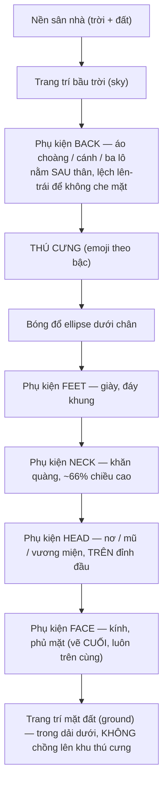

# PRD — Bé chọn bạn đồng hành & gắn phụ kiện gọn gàng (RubyLingo)

**Loại:** PRD ngắn (simple PRD) — không có phân tích đối thủ, không có ma trận thị trường.
**Ngôn ngữ:** tiếng Việt (ngôn ngữ giao diện của app).
**Ngày:** 2026-10-09 · **Người viết:** Xu (PM) · **Trạng thái:** chờ kiến trúc sư

---

## 0. Bối cảnh & vấn đề

Chủ dự án (anh Steven) xem ảnh chụp thật trên VPS và phàn nàn **hai** điều:

1. **Không có màn cho bé chọn thú cưng.** Cả app chỉ có đúng một linh vật Momo, và bé mới vào
   luôn thấy **quả trứng 🥚** (vì chưa đủ 20 từ) — một thứ không phải "con vật của mình".
2. **Phụ kiện gắn lên thú cưng trông như dán sticker.** Nơ + mũ **xếp cạnh nhau lơ lửng trên đầu**,
   kính **đè lên mặt**, còn bóng bay/đèn lồng/tranh **treo thành một hàng rời rạc phía trên khung**.

Chủ dự án **đã chốt: "CẢ HAI"** — vừa thêm màn chọn thú cưng, vừa sửa cách gắn phụ kiện.

### Triết lý bất biến (mọi đề xuất dưới đây phải tuân)

Không bao giờ mắng trẻ · không xếp hạng, không hẹn giờ · `happiness` có **sàn = 1** ·
**không lấy gì của bé mà không đổi lại được gì** · COPPA/GDPR-K (chỉ biệt danh + tuổi + avatar) ·
chữ **≥ 16px**, vùng chạm **≥ 64px**, nút chính **≥ 88px** · **chỉ tiếng Anh được đọc lên** (en-GB).

---

## 1. Mục tiêu sản phẩm

1. **Bé được tự chọn bạn đồng hành của mình** và **thấy con đó ngay từ 0 từ** — không còn bị áp
   một quả trứng mà bé không chọn.
2. **Thú cưng trông như một con vật được chăm**, không phải một bảng dán emoji: phụ kiện nằm đúng
   chỗ trên cơ thể, nhiều món cùng vị trí vẫn xếp gọn và vẫn nhìn ra con vật.
3. **Cảnh quanh nhà đọc ra thành một "sân nhà"** (bầu trời ở trên, mặt đất ở dưới) thay vì hai hàng
   trang trí rời rạc — mà bật hết 10 món vẫn **không đè lên nhau**.

---

## 2. User stories

- **Là bé 7 tuổi**, em muốn **chọn con thú cưng em thích (mèo, chó, hổ…)** để **em thấy nó là của
  em ngay, không phải chờ đủ 20 từ mới thấy quả trứng nở**.
- **Là bé 7 tuổi**, em muốn **đổi bạn đồng hành khi em đổi ý** mà **không bị mất sao, không mất đồ
  em đã mua, và không bị ai mắng**.
- **Là bé 7 tuổi**, em muốn **đội mũ + đeo kính + quàng khăn cho bạn ấy** và **thấy bạn ấy trông
  ngộ nghĩnh, đẹp** — chứ không phải một đống hình dán chồng lên nhau.
- **Là bé 7 tuổi**, em muốn **thấy bạn ấy lớn lên khi em học thêm từ** (nhóc con → trưởng thành →
  siêu cấp) để **em thấy mình đang giỏi lên**.
- **Là bố mẹ**, tôi muốn **con tôi được tự chọn linh vật** mà **không phải nhập thêm thông tin cá
  nhân nào** và **không bị chặn khỏi việc học**.

---

## 3. Yêu cầu (P0 / P1 / P2)

**P0 — bắt buộc cho bản sửa này**

| # | Yêu cầu |
|---|---|
| P0-1 | **Danh mục thú cưng** `shared/content/pets.json` (6 con) + `petsFileSchema` + module tra cứu `shared/content/pets.ts`. Emoji + tên là **dữ liệu**, không phải code. |
| P0-2 | **Bỏ hẳn giai đoạn `egg`**: `evolutionStages` còn **3 bậc** (nhóc con → trưởng thành → siêu cấp). Cập nhật `EvolutionStage`, `xpLevelsFileSchema`, `xp-levels.json`. |
| P0-3 | **Migration `011_pet_type.sql`**: thêm cột `pet_type` vào `pet_state`; đổi `CHECK`/`DEFAULT` của `evolution_stage` và map `'egg' → 'baby'`. **Không sửa migration cũ.** |
| P0-4 | **Server là trọng tài**: `POST /api/children/:id/pet/type` + `choosePetRequestSchema`; server **tự tra danh mục** để kiểm `petType`, client **không** được tự quyết trạng thái. |
| P0-5 | `PetState` + `RewardSnapshot` trả thêm `petType` và `petChosen`. |
| P0-6 | **Màn "Chọn bạn đồng hành"** (route `/pet/chon`) + nút **"Đổi bạn đồng hành"** trong Nhà thú cưng + **tự mời chọn khi `petChosen = false`**. |
| P0-7 | **Đổi bạn đồng hành MIỄN PHÍ, không giới hạn**; giữ nguyên `happiness`, tiến độ học, và toàn bộ đồ đã mua. |
| P0-8 | **`PetAvatar` vẽ theo `petType` + 3 bậc** (emoji mặt → emoji toàn thân → to hơn + ✨). |
| P0-9 | **Sửa cách gắn phụ kiện**: neo theo vị trí cơ thể; nhiều món cùng vị trí xếp thành **cụm** đúng chỗ, **không lơ lửng**. |
| P0-10 | **Khung "sân nhà"**: dải bầu trời (trên) + dải mặt đất (dưới) nằm **trong khung**, có nền; 10 món bật hết vẫn không đè nhau. |
| P0-11 | Giữ nguyên mọi luật bất biến ở mục 0 (chữ ≥16px, chạm ≥64px, nút chính ≥88px, chỉ đọc tiếng Anh, sàn ❤️ = 1, không mắng). |

**P1 — nên có**

- P1-1 Chạm một con trong màn chọn → **đọc tên tiếng Anh** của con đó (en-GB) — vừa là phản hồi, vừa
  là một mini-bài học từ vựng.
- P1-2 Hai dải có **nhãn nhỏ** ("Trên trời" / "Mặt đất") và một câu gợi ý mua thêm đồ ở Cửa hàng.
- P1-3 **Đổi nhãn ở màn tạo hồ sơ**: avatar của bé hiện đang gọi là *"bạn đồng hành"* (khoá
  `child.avatar`) — trùng tên với **thú cưng**. Đổi thành "Ảnh đại diện của bé" để bé không lẫn.
- P1-4 Màn Hồ sơ nhà thám hiểm hiện **tên con bé đã chọn** thay vì chữ "Momo" cố định.
- P1-5 Hiệu ứng nhỏ khi đổi con (một nhịp "chào bạn mới").

**P2 — làm sau**

- P2-1 Hoạt ảnh **"trứng nở" một lần** lúc bé vừa chọn con (cho bé nào thích), rồi biến mất — không
  biến trứng thành một giai đoạn thường trực.
- P2-2 Dọn **hai cột chết** `evolution_stage` + `equipped_item_ids` trong một migration riêng.
- P2-3 Phụ kiện "hợp gu" theo từng con (mũ hợp mèo khác hợp rồng) — cần thêm ảnh/emoji, chưa có
  nguồn.
- P2-4 Giới hạn mềm số món cùng một vị trí (không cần cho MVP; server hiện không cấm và **cấm là
  trái luật**).

---

## 4. Danh mục thú cưng — **6 con**

Đủ để bé có lựa chọn thật, ít để bé 7 tuổi không bị ngợp. Chọn con nào cũng **thấy con đó ngay từ
0 từ**.

| id (DB) | Tên tiếng Việt | Tên tiếng Anh (đọc lên) | Bậc 1 — Nhóc con | Bậc 2 — Trưởng thành | Bậc 3 — Siêu cấp |
|---|---|---|---|---|---|
| `monkey` | **Khỉ Momo** *(mặc định)* | Monkey | 🐵 | 🐒 | 🐒 + ✨ (to hơn ~20%) |
| `cat` | Mèo Miu | Cat | 🐱 | 🐈 | 🐈 + ✨ |
| `dog` | Cún Bông | Dog | 🐶 | 🐕 | 🐕 + ✨ |
| `tiger` | Hổ Vằn | Tiger | 🐯 | 🐅 | 🐅 + ✨ |
| `pig` | Heo Ỉn | Pig | 🐷 | 🐖 | **🐗** *(emoji thứ 3 riêng)* |
| `dragon` | Rồng Long | Dragon | 🐲 | 🐉 | 🐉 + ✨ |

### 4.1 Quy tắc emoji cho 3 bậc (khi một con không đủ 3 emoji khác nhau)

Thực tế emoji **rất ít** con có đủ 3 hình cho 3 giai đoạn. Quy tắc cố định, áp cho **mọi** con:

1. **Bậc 1 (Nhóc con)** = emoji **MẶT** (dạng "con non"): 🐵 🐱 🐶 🐯 🐷 🐲.
2. **Bậc 2 (Trưởng thành)** = emoji **TOÀN THÂN** (dạng "lớn"): 🐒 🐈 🐕 🐅 🐖 🐉.
   → Bậc 1 → bậc 2 đã là một bước "lớn lên" nhìn thấy được, **không cần emoji thứ ba**.
3. **Bậc 3 (Siêu cấp)** = dùng emoji của bậc 2 **phóng to thêm ~20%** + **hiệu ứng lấp lánh ✨**
   (CSS, token có sẵn) + **viền sáng**. Nếu con đó **có** emoji thứ ba thật (Heo → 🐗) thì dùng nó.

**Cỡ theo bậc** (khung 200×200 trên điện thoại, co giãn theo `--fs-*`/breakpoint):
bậc 1 ≈ **84px** · bậc 2 ≈ **104px** · bậc 3 ≈ **124px**.

**Ràng buộc emoji:** tất cả emoji trên là **1 codepoint, phổ thông, có mặt trên iPhone + Android**.
**Không dùng** emoji ghép ZWJ (🐈‍⬛, 🐻‍❄️, 🐕‍🦺…) vì hay vỡ trên một số máy Android.

### 4.2 Không đụng vào emoji đã dùng ở chỗ khác (tránh bé nhầm)

App đã dùng các emoji sau — **danh mục thú cưng không được lấy lại**:

- **5 linh vật dẫn đường**: 🐵 Momo · 🐰 Bông · 🐢 Rocky · 🦜 Pico · 🐿️ Nut.
- **8 avatar của bé**: 🦊 🐼 🐨 🦁 🐸 🦉 🐙 🦄.
- **Vật phẩm cửa hàng**: 🍌🥕🍎🍪🍯🥛🧃🍉🍦🎂 🎀🎩🕶️🧣👟🎒👑😎🦸🦋 🎈🪴🏮🖼️🌻🎏🏡🐠🌈🏰.

> ⚠️ **Ghi chú cho chủ dự án:** `monkey` 🐵 **trùng** với linh vật dẫn đường Momo — nhưng đó **vốn
> đã là** thú cưng hiện tại, nên giữ lại để **các bé đang chơi trên VPS không thấy con mình đổi
> hình**. 5 con còn lại dùng emoji **chưa xuất hiện ở đâu trong app**.

### 4.3 Nơi lưu & kiểu dữ liệu

- Nội dung: **`shared/content/pets.json`** (mảng `pets`, mỗi phần tử: `id`, `name_vi`, `name_en`,
  `iconBaby`, `iconAdult`, `iconSuper`, `phase`). Zod schema mới **`petsFileSchema`** trong
  `shared/schemas/content.ts` kiểm lúc nạp (giống `shopItemsFileSchema`): id hợp lệ, **id không
  trùng**, đủ 3 emoji, `name_en` không rỗng. Danh mục sai ⇒ **server không khởi động được**.
- Tra cứu: **`shared/content/pets.ts`** (lá, giống `levels.ts`): `PET_DEFINITIONS`,
  `DEFAULT_PET_ID = 'monkey'`, `getPetDefinition(id)`, `isPetId(id)`, `petEmojiFor(id, stage)`.
- `DEFAULT_PET_ID` là **một hằng duy nhất**, dùng chung cho migration, ChildService và client.

---

## 5. Giai đoạn tiến hoá — **CHỌN PHƯƠNG ÁN (a): BỎ HẲN GIAI ĐOẠN TRỨNG**

### Quyết định

**Bỏ `egg`. Tiến hoá còn 3 bậc.** Bé chọn con nào thì **thấy con đó ngay từ 0 từ**, không qua trứng.

| bậc | id | tên hiển thị | số từ cần |
|---|---|---|---|
| 1 | `baby` | Nhóc con | **0** |
| 2 | `adult` | Trưởng thành | **40** |
| 3 | `super` | Siêu cấp | **120** |

*(Mốc 40/120 nhằm cho bé thấy "lớn lên" sớm hơn; nếu chủ dự án muốn giữ nhịp cũ thì đổi thành
80/200 — chỉ sửa JSON, không sửa code. Xem câu hỏi Q1.)*

### Vì sao chọn (a) chứ không phải (b)

- (b) giữ quả trứng và chỉ "trang trí cho nó thành trứng của con đã chọn" ⇒ **vẫn là thứ chủ dự án
  vừa chê**, và **bé vẫn phải chờ đủ 20 từ** mới thấy con vật mình chọn. Không giải quyết được
  phàn nàn gốc.
- (a) cho bé **thấy ngay** con mình chọn — đúng câu chủ dự án nói: *"cho các bé chọn"*.
- **Chi phí của (a) thấp hơn tưởng tượng** — xem phát hiện ngay dưới đây.

### 🔎 Phát hiện quan trọng cho kiến trúc sư: cột `evolution_stage` **đã chết**

`RewardService.readPet()` **cố tình KHÔNG `SELECT evolution_stage`** — tiến hoá được **suy ra từ số
từ đã học** (`countLearnedWords` → `evaluateEvolution`). Cột chỉ còn được **GHI** lúc tạo hồ sơ
(`ChildService.createChild`, `RewardService.ensurePetRow`), **không nơi nào ĐỌC**.

⇒ Việc bỏ `egg` **không** cần đụng cột để chạy đúng. Nhưng ta **vẫn làm migration** để (1) thêm
`pet_type` và (2) **đổi `CHECK` để giá trị `'egg'` không thể sống lại** — đúng nguyên tắc "không để
lại cái bẫy im lặng" của dự án (xem chú thích `equipped_item_ids` trong `RewardService.ts`).

### Việc phải sửa (danh sách chính xác)

| Chỗ | Sửa gì |
|---|---|
| `shared/content/xp-levels.json` | `evolutionStages` còn **3 phần tử**: `baby`(0), `adult`(40), `super`(120). Bỏ `egg`. |
| `shared/schemas/content.ts` | `xpLevelsFileSchema.evolutionStages.stage`: `z.enum(['baby','adult','super'])`. |
| `shared/types/reward.ts` | `EvolutionStage = 'baby' \| 'adult' \| 'super'`. Thêm `PetType`, `PetDefinition`. |
| `shared/content/levels.ts` | Không đổi logic; `getEvolutionStage(0)` tự trả bậc đầu. |
| `server/services/ChildService.ts` | `createChild`: ghi `pet_type = NULL` (chưa chọn) và `evolution_stage = 'baby'`. |
| `server/services/RewardService.ts` | `ensurePetRow`: `'baby'`. `readPet`: đọc thêm `pet_type`. Thêm `choosePet()`. |
| `server/db/migrations/011_pet_type.sql` | Xem mục 8.2. |

> ⚠️ **Ảnh hưởng lên bé đang chơi:** bỏ `egg` chỉ làm bậc **nhích LÊN** (không bao giờ xuống) ⇒
> với luật "không mất gì của bé" thì đây là **thăng hạng**, không phải mất mát.

---

## 6. Màn "Chọn bạn đồng hành" — ở đâu & khi nào

### Quyết định: **đặt trong "Nhà thú cưng"** (không đặt ở màn tạo hồ sơ)

**Vì sao KHÔNG đặt ở màn tạo hồ sơ (`/children/new`) của bố mẹ:**

- Đó là **màn của bố mẹ** (bọc `RequireParent`). Trộn việc vui của bé vào form của bố mẹ làm form
  dài thêm, và **bố mẹ có thể tạo hồ sơ lúc bé không ở đó** ⇒ "bé chọn" thành "bố mẹ chọn hộ".
- Tuy `petType` **không phải** dữ liệu cá nhân (COPPA vẫn an toàn nếu đặt ở đó), nhưng **giữ form
  của bố mẹ sạch** là lựa chọn đúng về vai.
- Đặt trong Nhà thú cưng ⇒ **dùng chung một luồng cho cả bé MỚI và bé ĐÃ CÓ hồ sơ** (giải quyết
  luôn yêu cầu #5), và **không chặn bé khỏi việc học** (Nhà thú cưng không phải bài học).

### Luồng

```
Bé vào Nhà thú cưng (/pet)
        │
        ├─ petChosen = false  →  tự mở màn chọn (/pet/chon), có nút "Để sau"
        │                        ("Để sau" ⇒ giữ Momo 🐵, không hỏi lại trong phiên này)
        │
        └─ petChosen = true   →  hiện khung Nhà thú cưng bình thường
                                 + nút "Đổi bạn đồng hành" (góc trên phải, ≥ 64px)
```

### Đặc tả UI — màn `/pet/chon`

- **Tiêu đề:** "Bé chọn bạn đồng hành nhé!" (chữ `text-kid-xl`).
- **Lưới thẻ:** 6 thẻ, **2 cột** trên điện thoại dọc, **3 cột** từ tablet/laptop.
  Mỗi thẻ là **một nút** (`aria-pressed` cho thẻ đang chọn — theo đúng mẫu đang dùng ở
  `ChildProfileSetupPage`, **không** dùng `role="tab"`):
  - emoji bậc 1 của con đó, **≥ 64px**;
  - tên tiếng Việt (chữ `text-kid-md`, **≥ 20px**);
  - tên tiếng Anh (chữ `text-kid-xs` = **16px**, màu `text-ink-faint` — không nhỏ hơn 16px);
  - thẻ đang chọn: `border-brand bg-brand-soft`; chưa chọn: `border-line bg-surface-raised`.
  - **Vùng chạm của cả thẻ ≥ 88px** (thẻ là nút chính).
- **Nút chính "Chọn bạn này!"** — toàn dòng, **≥ 88px**, chỉ sáng khi đã chọn một con.
- **Liên kết "Để sau"** — giữ Momo 🐵, quay lại Nhà thú cưng. **Không** làm bé cảm thấy bị bỏ rơi
  (câu chữ trung tính: "Để sau cũng được nhé").
- **Không đọc tiếng Việt.** (P1-1: chạm một con ⇒ đọc **tên tiếng Anh**, en-GB.)
- Không hỏi thêm bất kỳ thông tin nào (COPPA).

### Đặc tả API (server là trọng tài)

- `POST /api/children/:id/pet/type` — body `{ petType: "cat" }` (Zod `choosePetRequestSchema`).
- Server **tự tra `pets.json`** để kiểm `petType`; id lạ ⇒ lỗi `validation` **rõ ràng cho bố mẹ**,
  bé thì thấy màn "thử lại", **không** thấy lỗi kỹ thuật.
- Trả về `PetState` **đã cập nhật** (giống mẫu `EquipmentResult`: trả cả trạng thái nhìn thấy được).
- **Đổi con KHÔNG trừ ⭐, KHÔNG tiêu đồ, KHÔNG đụng `happiness`.**

---

## 7. Khung "Nhà thú cưng" sau khi sửa — đặc tả UI

### 7.1 Bố cục: một "sân nhà" gồm **ba dải dọc**, không chồng nhau

```
┌───────────────────────────────────────────────┐
│  ☁️  DẢI BẦU TRỜI  (nền trời, gradient nhạt)   │  ← trang trí slot "sky"
│      🎈 🏮 🖼️ 🎏 🌈   (flex-wrap, căn giữa)     │     xếp trong dải, KHÔNG đè nhau
├───────────────────────────────────────────────┤
│                                               │
│           KHU THÚ CƯNG  (ô vuông cố định)      │  ← thú cưng + phụ kiện (7.2)
│              🐈  + 🎀🎩👑🕶️🧣👟               │
│                                               │
├───────────────────────────────────────────────┤
│  🌱 DẢI MẶT ĐẤT  (nền đất/cỏ, dải màu)         │  ← trang trí slot "ground"
│      🪴 🌻 🏡 🐠 🏰   (flex-wrap, căn đáy)     │     xếp trong dải, KHÔNG đè nhau
└───────────────────────────────────────────────┘
        ▲ cả ba nằm TRONG MỘT thẻ bo góc `rounded-card` = "sân nhà"
```

**Thay đổi so với hiện tại:** hai hàng trang trí đang **nằm NGOÀI khung** và trông rời rạc ⇒ nay
đưa **vào trong khung**, mỗi dải có **nền riêng** (trời nhạt ở trên, đất/cỏ ở dưới) nên đọc ra
**một cảnh**, không phải một hàng sticker. Thêm **bóng đổ ellipse** dưới chân thú cưng để con vật
"đứng trên mặt đất" (cảm giác được chăm, không lơ lửng).

**Không đè nhau (kể cả 10 món):** mỗi dải vẫn là **một hàng `flex-wrap`** ⇒ món tự xuống dòng, và
ba dải **không giao nhau về không gian** ⇒ **bất khả thi** để hai món chồng lên nhau. Đây là lý do
giữ cách xếp hàng (thay vì toạ độ tuyệt đối) — toạ độ tuyệt đối đẹp trên laptop và **vỡ trên
iPhone 320px**.

*(P1-2: nhãn nhỏ "Trên trời" / "Mặt đất" ở đầu mỗi dải.)*

### 7.2 Gắn phụ kiện lên thân — neo theo vị trí, xếp thành **cụm**

Khung thú cưng: **ô vuông cố định 200×200** (điện thoại) — cố định để toạ độ phần trăm luôn đúng
trên mọi bề rộng màn hình.

**Thứ tự lớp vẽ (z-order), từ sau ra trước** — giữ đúng thứ tự `ACCESSORY_SLOTS`:



**Bảng neo (toạ độ theo % của ô 200×200):**

| slot | món | neo | cỡ (tỉ lệ với thú cưng) | khi có **nhiều món cùng slot** |
|---|---|---|---|---|
| `back` | 🦸 áo choàng · 🦋 cánh · 🎒 ba lô | trên-trái, sau thân (x ≈ 2%, y ≈ 34%) | 0,33 × thú cưng | xếp **chéo cụm** (x: 2% / −8% / −18%; y: 28% / 36% / 44%) — cả 3 đều thấy, thò ra sau vai |
| `feet` | 👟 giày | đáy khung, căn giữa (y ≈ 92%) | 0,25 × | lệch ngang ±8% |
| `head` | 🎀 nơ · 🎩 mũ · 👑 vương miện | **đỉnh đầu**, căn giữa (y ≈ 6%) | 0,30 × | xếp **cung nông** trên đỉnh đầu (x: −14% / 0% / +14%; y: 10% / 4% / 10%) — dính vào đầu, KHÔNG bay lên trời |
| `neck` | 🧣 khăn quàng | ~66% chiều cao, căn giữa | 0,25 × | lệch ngang ±8% |
| `face` | 🕶️ kính · 😎 kính ngôi sao | ~40% chiều cao, căn giữa | 0,27 × | món **đầu tiên** full cỡ trên mặt; món **thứ hai** nhỏ hơn (0,22 ×) lệch lên-phải (x +12%, y −8%) để vẫn thấy |

**Vì sao "cụm" chứ không phải "hàng flex ngang" (lỗi hiện tại):** hàng flex đặt nơ + mũ **cạnh
nhau giữa không trung phía trên đầu** ⇒ trông như dán sticker. Neo vào **đỉnh đầu** + xếp **cung
nông** + cỡ **theo tỉ lệ đầu** ⇒ đọc ra "đồ trang trí trên đầu con vật".

**Quy tắc bắt buộc:**

- **Cỡ phụ kiện tỉ lệ với cỡ thú cưng**, không phải cỡ cố định — để con "siêu cấp" to hơn không bị
  đội mũ tí hon.
- **Không bao giờ bỏ món của bé.** Nhiều món cùng vị trí ⇒ xếp cụm; **tuyệt đối không** tự ẩn/thay
  món (đó là "lấy đồ của bé").
- **Không dùng `style={{ transform }}` inline** — Tailwind đặt vị trí bằng chính `transform`; dùng
  lớp `translate`/`rotate` của Tailwind (bẫy đã trả giá ở T056, xem chú thích `PetAvatar.tsx`).
- **Màu/cỡ/bo góc chỉ lấy từ `src/styles/tokens.css`.** Hiệu ứng ✨ bậc 3 dùng hiệu ứng có sẵn;
  nếu cần một token mới cho "viền sáng siêu cấp" thì **nêu rõ "cần thêm token"**, không hardcode.
- **Tôn trọng `prefers-reduced-motion`**: hiệu ứng ✨ tắt khi bé bật giảm chuyển động.

### 7.3 Phần còn lại của màn

- **Header:** tên con bé đã chọn (tra từ `pets.json`) + nút **"Đổi bạn đồng hành"** (≥ 64px) +
  `HeartMeter`.
- **Dưới khung:** chú thích bậc (chữ thật, **ngoài** khối `role="img"` để trình đọc màn hình đọc
  được — giữ nguyên như hiện tại).
- **Nhãn đọc lên** (`aria-label`) của khối `role="img"` cập nhật theo tên con + bậc + danh sách đồ.
- **Ba tab cửa hàng + lưới vật phẩm giữ nguyên.**

---

## 8. Hợp đồng dữ liệu / schema / migration (bàn giao cho kiến trúc sư)

### 8.1 Kiểu & schema

- `shared/types/reward.ts`:
  - `EvolutionStage = 'baby' | 'adult' | 'super'` *(bỏ `'egg'`)*.
  - `type PetType = string` *(danh mục mở — thêm con = sửa JSON)*, `PetDefinition { id, name_vi, name_en, iconBaby, iconAdult, iconSuper, phase }`.
  - `PetState` thêm: `petType: PetType` *(đã phân giải, **không bao giờ null**)* và
    `petChosen: boolean` *(`false` = bé chưa từng chọn, đang xem mặc định Momo)*.
- `shared/schemas/content.ts`: thêm **`petsFileSchema`**; sửa enum `stage` của
  `xpLevelsFileSchema`.
- `shared/schemas/reward.ts`: thêm
  `choosePetRequestSchema = z.object({ petType: z.string().trim().min(1).max(40) })`
  *(không có giá, không có trạng thái — **server tự tra danh mục**, đúng nguyên tắc "client không
  bao giờ nói cho server biết phải trừ bao nhiêu / con nào hợp lệ")*.

### 8.2 Migration `011_pet_type.sql` (file mới, **không sửa file cũ**)

Thêm cột `pet_type` **và** đổi `CHECK` của `evolution_stage` (SQLite không `ALTER CHECK` được ⇒
phải dựng lại bảng):

```sql
-- Dựng lại pet_state: thêm pet_type, siết CHECK của evolution_stage, map 'egg' -> 'baby'
CREATE TABLE pet_state_new (
  child_id          TEXT PRIMARY KEY REFERENCES child_profile (id) ON DELETE CASCADE,
  -- NULL = bé CHƯA từng chọn (hiển thị mặc định Momo 🐵). Không CHECK enum:
  -- "có những con nào" là DỮ LIỆU (pets.json), không phải hằng số code.
  pet_type          TEXT,
  evolution_stage   TEXT NOT NULL DEFAULT 'baby'
                      CHECK (evolution_stage IN ('baby','adult','super')),
  happiness         INTEGER NOT NULL DEFAULT 3 CHECK (happiness BETWEEN 1 AND 5),
  equipped_item_ids TEXT NOT NULL DEFAULT '[]',
  last_fed_at       TEXT,
  updated_at        TEXT NOT NULL
);

INSERT INTO pet_state_new
  (child_id, pet_type, evolution_stage, happiness, equipped_item_ids, last_fed_at, updated_at)
SELECT child_id, NULL,
       CASE WHEN evolution_stage = 'egg' THEN 'baby' ELSE evolution_stage END,
       happiness, equipped_item_ids, last_fed_at, updated_at
  FROM pet_state;

DROP TABLE pet_state;
ALTER TABLE pet_state_new RENAME TO pet_state;
```

**Vì sao đặt `pet_type` KHÔNG có `CHECK ... IN (...)`:** theo đúng tiền lệ của cột `level` ở
`xp_state` — *"số cấp là DỮ LIỆU, không phải hằng số code"*. Thêm con thứ 7 mà phải viết migration
chỉ để nới một danh sách là sai. Thay vào đó: **ghi thì kiểm ở tầng ứng dụng** (server tra
`pets.json`, id lạ ⇒ từ chối), **đọc thì chịu được dữ liệu lạ** (`getPetDefinition` không tìm thấy
⇒ **rơi về `DEFAULT_PET_ID`** và ghi log, **không ném lỗi làm trắng màn hình của bé**).

> ⚠️ **Bẫy cho người viết migration:** runner bọc **mỗi file trong MỘT transaction** và
> `foreign_keys = ON`. `PRAGMA foreign_keys = OFF` **không có tác dụng trong transaction**.
> Ở đây **không cần tắt FK**: `pet_state` là bảng **CON** (không bảng nào tham chiếu nó), nên
> `DROP`/`RENAME` không vi phạm khoá ngoại. Đừng thêm `PRAGMA` vào file migration.

### 8.3 Các chỗ chạm cần nhớ (server & client)

- `server/services/RewardService.ts`: `readPet` **thêm `SELECT pet_type`** và trả `petType` +
  `petChosen`; `ensurePetRow` ghi `pet_type` NULL + `'baby'`; thêm `choosePet(parentId, childId, petType)`.
- `server/routes/rewards.ts`: thêm route `POST …/pet/type`.
- Client: `rewardStore`/`shopStore` + hook (mẫu `useShop`) thêm `choosePet`; màn `/pet/chon`;
  `PetHousePage` thêm nút "Đổi bạn đồng hành" + tự mở khi `!petChosen`; `PetAvatar` vẽ lại.
- i18n `src/i18n/vi.ts`: thêm khoá cho màn chọn + nút đổi con (giữ chữ trung tính, **không** chữ
  mắng). Bỏ chỗ dùng cứng chữ "Momo" ⇒ tra tên từ `pets.json`.
- **Test cần cập nhật:** `pet-avatar.test.tsx`, `pet-house-page.test.tsx`, `pet-evolution.test.ts`,
  `reward-service.test.ts`, `child-service.test.ts`, `explorer-profile-page.test.tsx`.

---

## 9. Câu hỏi cần chủ dự án xác nhận

1. **Nhịp tiến hoá mới:** 3 bậc với mốc **0 / 40 / 120** từ — có ổn không? (Muốn giữ nhịp cũ thì
   đổi thành 0 / 80 / 200; chỉ sửa `xp-levels.json`.)
2. **Danh sách 6 con** (Khỉ Momo · Mèo Miu · Cún Bông · Hổ Vằn · Heo Ỉn · Rồng Long) — đúng gu
   chưa? Muốn thêm/bớt con nào? (Thêm con = thêm một dòng JSON.)
3. **Giữ "Khỉ Momo 🐵" làm mặc định** cho các bé **đã có hồ sơ trên VPS** (để con của bé không đổi
   hình đột ngột) — đồng ý không?
4. **Số lần đổi bạn đồng hành:** đề xuất **không giới hạn, miễn phí** (giới hạn = một hình phạt
   nhẹ với trẻ). Có muốn khác không?
