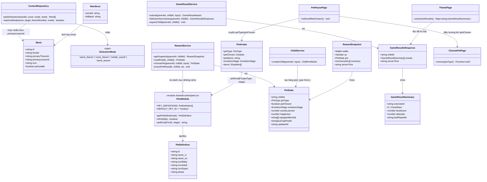
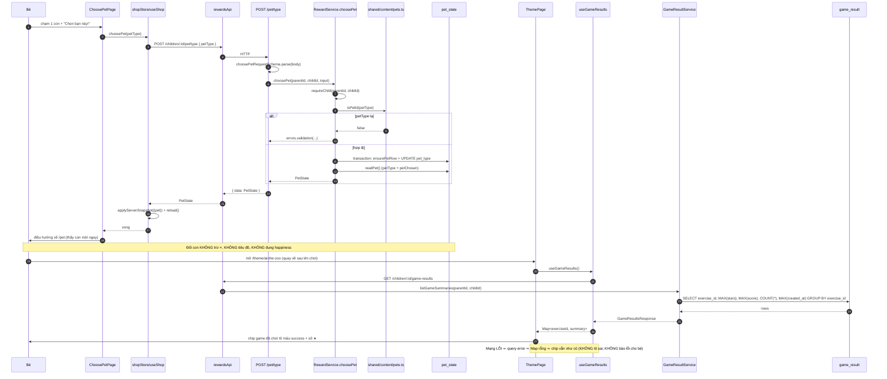

# THIẾT KẾ & PHÂN RÃ CÔNG VIỆC — RubyLingo (4 điểm: A · B · C · D)

**Người viết:** 高见远 (Gao) — Kiến trúc sư · **Ngày:** 2026-10-09 · **Trạng thái:** bàn giao kỹ sư
**Nguồn:** `docs/ux-20261009/PRD-thu-cung.md` + các dữ kiện team-lead đã kiểm chứng trong mã.

> Tài liệu này CHỈ thiết kế. Không có mã triển khai ở đây — mọi khối mã là **đặc tả dán-được** cho kỹ sư.

---

## 0. Bất biến phải giữ (mọi phương án dưới đây tuân thủ)

- **Server là trọng tài.** Client không tự tính/tự quyết điểm, sao, tiến hoá, giá, con hợp lệ. Route VÀ
  service **cùng** `.parse()` trên **cùng một** schema Zod trong `shared/`.
- **Không mắng trẻ** (cấm "sai/kém/chưa đạt"; chỉ *"Bé thử lại nhé!"*) · không xếp hạng, không hẹn giờ ·
  `happiness` **sàn = 1** · **không lấy gì của bé mà không đổi lại được gì**.
- Chữ **≥16px**, vùng chạm **≥64px**, nút chính **≥88px** · **chỉ tiếng Anh (`en-GB`) được đọc lên**.
- Màu/cỡ/bo góc/vùng chạm **chỉ lấy từ `src/styles/tokens.css`**; không hardcode mã màu trong `.tsx`.
- Migration là **bất biến**: chỉ **thêm** file mới, đánh số tiếp (`011_*.sql`). Đã có `001`–`010`.
- Đổi `shared/` = đổi **cả** client và server.
- **Không thêm gói npm mới.** (Thiết kế này không cần gói nào mới.)

---

# PHẦN A — THIẾT KẾ HỆ THỐNG

## A.1 Điểm khó & cách tiếp cận

| Điểm | Khó ở đâu | Cách tiếp cận |
|---|---|---|
| **(A)** Thú cưng | Bỏ bậc `egg` làm `stageDefinition()` **NÉM LỖI** với id lạ; dữ liệu cũ `pet_type = NULL`; đổi `EVOLUTION_STAGES` lan ra **~15 tệp test**; phải dựng lại bảng `pet_state` (SQLite không `ALTER CHECK`) | Dữ liệu hoá danh mục (`pets.json` + `pets.ts` lá, **không ném** khi id lạ ⇒ rơi về mặc định); migration `011` map `egg→baby`; tách "bậc tiến hoá" (số từ) khỏi "loài" (`pet_type`) |
| **(B)** Biểu tượng nhỏ | `` ăn theo `font-size` (chỉnh cho emoji) trong khi khung chứa lớn hơn 3–8 lần; **không** dùng được container-query plugin (Tailwind 3.4 không có); phải giữ nhánh emoji **tương đương** nhánh ảnh | **Container query units (`cqw`)** khai bằng CSS thường trong tệp mới, `container-type: inline-size` trên khung; 1 token `--fs-icon-fill`; có `@supports` dự phòng |
| **(C)** Nhiễu quá dễ | `pickDistractors` có 3 điều kiện cứng **không được nới**; hàm trả **ít hơn** `count` khi thiếu từ; phải chứng minh z3 đủ ô | Thêm chế độ `same_lesson` (dùng `Word.primaryLessonId` — **đã có sẵn**, không đổi chữ ký hàm); chỉ đổi dữ liệu 3 bài `at-the-zoo` |
| **(D)** Chip game | Client **không có** dữ liệu theo-game; `game_result` **có lưu** nhưng **chưa có đường đọc**; **không được** nhét vào `progressSnapshotSchema` (đó là kênh GHI) | Thêm **kênh ĐỌC riêng**: `GET …/game-results` (SQL gộp theo `exercise_id`), hook react-query v5, `ThemePage` đọc |

**Mẫu kiến trúc:** giữ nguyên mẫu hiện có — REST + service theo miền (`RewardService`, `GameResultService`…),
store client zustand + `@tanstack/react-query` cho dữ liệu chỉ-đọc, schema Zod dùng chung ở `shared/`.

---

## A.2 Danh sách tệp (chi tiết ở Phần C)

Xem **§C.1 Tệp tạo mới** và **§C.2 Tệp sửa**.

---

## A.3 Sơ đồ lớp (classDiagram)



*(Bản `.mermaid` rời: `docs/ux-20261009/class-diagram.mermaid`.)*

---

## A.4 Luồng gọi (sequenceDiagram)



*(Bản `.mermaid` rời: `docs/ux-20261009/sequence-diagram.mermaid`.)*

---

# PHẦN B — PHƯƠNG ÁN TỪNG VIỆC (và phương án bị loại)

## B.1 (A) Bé chọn thú cưng + gắn phụ kiện

### Phương án CHỌN
1. **Dữ liệu hoá danh mục**: `shared/content/pets.json` (6 con) + `shared/content/pets.ts` (lá, giống
   `levels.ts`). `getPetDefinition(id)` **KHÔNG ném** — id lạ ⇒ trả định nghĩa `DEFAULT_PET_ID` (`monkey`)
   và bên gọi (server) ghi log. Đây là điểm khác biệt **có chủ ý** so với `stageDefinition()` (vốn ném):
   bậc tiến hoá do **server** sinh ra nên id lạ nghĩa là lệch phiên bản (phải ồn ào); còn `pet_type` là
   **dữ liệu DB** có thể cũ ⇒ phải chịu được, **không được làm trắng màn hình của bé**.
2. **Bỏ `egg`**: `EvolutionStage = 'baby' | 'adult' | 'super'`; `xp-levels.json` còn 3 bậc (0/40/120).
3. **Migration `011_pet_type.sql`**: dựng lại `pet_state` để thêm `pet_type` (nullable, **không** CHECK enum
   — danh mục là DỮ LIỆU) + siết `CHECK (evolution_stage IN ('baby','adult','super'))` + map `'egg'→'baby'`.
4. **`choosePet`**: server tự tra `pets.json`; id lạ ⇒ `errors.validation`. Không trừ tiền, không tiêu đồ,
   không đụng `happiness`.
5. **`PetAvatar` vẽ lại**: 1 thẻ "sân nhà" 3 dải dọc (trời / ô thú cưng 200×200 / đất); phụ kiện neo theo
   **%** và xếp **cụm** theo bảng PRD §7.2; bóng ellipse; bậc 3 thêm ✨ + viền sáng.

### Phương án BỊ LOẠI (1 câu mỗi cái)
- **Đặt màn chọn ở form tạo hồ sơ (`/children/new`)** — đó là màn của bố mẹ (RequireParent); bố mẹ có thể
  tạo hồ sơ lúc bé không có đó ⇒ "bé chọn" thành "bố mẹ chọn hộ", và làm form bố mẹ dài thêm.
- **Giữ `egg` và trang trí cho nó thành trứng của con đã chọn (phương án b)** — vẫn là thứ chủ dự án vừa
  chê và bé vẫn phải chờ đủ từ mới thấy con mình.
- **Cho `pet_type` một `CHECK IN (...)` trong migration** — thêm con thứ 7 sẽ phải viết migration chỉ để
  nới danh sách; "có những con nào" là DỮ LIỆU, không phải hằng số code (đúng tiền lệ cột `level` ở `xp_state`).
- **`getPetDefinition` ném khi id lạ (giống `stageDefinition`)** — một `pet_type` cũ/lạ trong DB sẽ làm
  **trắng màn hình Nhà thú cưng** của bé; ở đây ta chọn chịu được dữ liệu lạ.
- **Gắn phụ kiện bằng toạ độ tuyệt đối từng món** — đẹp trên laptop, **vỡ trên iPhone 320px**; giữ hàng
  `flex-wrap` trong mỗi dải thì 10 món bật hết **không thể** chồng nhau.
- **Cho `pet_type` mặc định ngay khi tạo hồ sơ (thay vì NULL)** — bé đã có hồ sơ trên VPS sẽ bị coi là
  "đã chọn Momo" và **không bao giờ** thấy màn chọn; `NULL` mới phân biệt được "chưa từng chọn".

### Hệ quả dữ liệu cũ / lệch phiên bản (BẮT BUỘC ghi rõ)
- **Hồ sơ cũ trên VPS**: sau migration `pet_type = NULL` ⇒ `readPet` trả `petType = 'monkey'`,
  `petChosen = false`. Bé thấy **đúng Momo 🐵 như cũ** (không mất gì) và **được mời chọn** ở Nhà thú cưng.
- **Client còn cache bậc `egg`** (không thể xảy ra với `evolutionStage` vì server **suy ra** từ số từ và
  chỉ trả `baby|adult|super`, nhưng vẫn phải nói rõ): nếu một client **cũ** gọi `stageDefinition('egg')`
  thì **NÉM**. Đây là lý do **bắt buộc** client và server deploy **cùng lúc** (build client nhúng
  `xp-levels.json` vào bundle). Ghi vào mục "Điểm cần làm rõ" (Q-A1).
- **Bé chơi liên tục**: bỏ `egg` chỉ làm bậc **nhích LÊN** (0 từ vẫn là `baby`) — không bao giờ xuống ⇒
  đúng luật "không mất gì của bé".

## B.2 (B) Biểu tượng lấp đầy khung

### Phương án CHỌN — **container query units (`cqw`)** + `container-type: inline-size`
- **Cơ chế**: khung chứa (nút/ô) được đặt `container-type: inline-size` ⇒ bên trong, `1cqw` = 1% **bề rộng
  content-box** của khung. Lớp bọc biểu tượng đặt `font-size: var(--fs-icon-fill)` (`= 82cqw`) ⇒ **cả ``
  (`1em`) lẫn emoji (chữ)** đều = 82% bề rộng khung ⇒ **hai nhánh trông tương đương**, và **không** phụ
  thuộc `font-size` dành cho emoji nữa.
- **Vì sao `inline-size` chứ không `size`**: `container-type: size` đòi khung có **chiều cao xác định**; thẻ
  flashcard cao theo nội dung ⇒ sẽ **sập chiều cao**. `inline-size` chỉ cần bề rộng xác định (mọi khung của
  ta đều có: `aspect-square`/`aspect-[4/5]`/`w-full`/`size-[132px]`) và **không** đụng chiều cao.
- **Hỗ trợ trình duyệt (đã tự kiểm)**: container query **length units** (`cqw/cqmin/…`) có từ
  **Chrome/Edge 105+**, **Safari 16.0+**, **iOS Safari 16.0+**, **Firefox 110+**, **Samsung Internet 20+**
  (≈ 2022-08 → 2023-02). Thiết bị đích (iPad/iPhone/Android Chrome/laptop) đều thoả.
- **Dự phòng khi KHÔNG hỗ trợ** (rất hiếm, nhưng phải có): dùng `@supports (font-size: 1cqw)` để chỉ bật
  `cqw` khi trình duyệt hiểu đơn vị; nếu không, lớp bọc giữ `font-size: 1em` ⇒ biểu tượng quay về **đúng
  hành vi cũ** (nhỏ hơn nhưng **KHÔNG vỡ layout, KHÔNG tràn khung**). Vì `1em` ≤ khung, không có rủi ro tràn.
- **Vì sao KHÔNG dùng**: *plugin `@tailwindcss/container-queries`* — Tailwind ở đây là 3.4.13 và `tailwind.config.ts`
  chỉ có 1 plugin tự viết (`hoverable`); thêm plugin = thêm gói npm (bị cấm) + phải khởi động lại vite.
- **Vì sao KHÔNG dùng**: *`width:100% height:100%` trên ``* — không co được **emoji** (emoji không
  co theo width/height, chỉ co theo `font-size`) ⇒ hai nhánh lệch cỡ, phá yêu cầu "tương đương".
- **Vì sao KHÔNG dùng**: *truyền cỡ px cố định cho từng chỗ gọi* — khung responsive theo bề rộng; cỡ cố định
  sẽ nhỏ lại trên laptop (đúng cái chủ dự án vừa chê) hoặc tràn trên iPhone SE.
- **Vì sao KHÔNG dùng**: *`transform: scale()` trên ``* — dự án **cấm** `style={{ transform }}` (Tailwind
  đặt vị trí bằng chính `transform`; bẫy đã trả giá ở T056) và scale cũng không giúp emoji.

### Lớp/thuộc tính đặt CHÍNH XÁC ở đâu
1. **`src/styles/tokens.css`** — thêm **1 token cỡ** (nguồn chân lý):
   ```css
   /* Cỡ biểu tượng từ vựng: tỉ lệ theo BỀ RỘNG KHUNG chứa (container query), KHÔNG theo font-size.
      Dùng bởi .wi-fill trong src/styles/word-icon.css. 82% để ảnh (có ~11% lề trong suốt)
      đọc ra ~73% cạnh khung. */
   --fs-icon-fill: 82cqw;
   ```
   (Token này nằm trong `:root`; đơn vị `cqw` chỉ **phân giải tại chỗ dùng** — luôn nằm trong một khung có
   `container-type`. Ở `:root` nó vô nghĩa nhưng vô hại, và không ai dùng nó ngoài `.wi-fill`.)
2. **TẠO MỚI `src/styles/word-icon.css`** (CSS thường — `tokens.css` chỉ chứa biến, không chứa tiện ích):
   ```css
   /* RubyLingo — Để biểu tượng từ vựng LẤP ĐẦY khung, không ăn theo cỡ chữ dành cho emoji.
      Xem docs/ux-20261009/THIET-KE.md §B.2.
      .wi-frame  = khung chứa (nút/ô) — mở "container" để đo bề rộng.
      .wi-fill   = lớp bọc biểu tượng — cỡ = 82% bề rộng khung, cho CẢ ảnh lẫn emoji. */
   .wi-frame {
     /* inline-size (KHÔNG phải size): chỉ cần bề rộng xác định; 'size' sẽ sập chiều cao
        của thẻ flashcard (cao theo nội dung). */
     container-type: inline-size;
   }
   .wi-fill {
     display: flex;
     align-items: center;
     justify-content: center;
     line-height: 1;
     /* Dự phòng khi trình duyệt KHÔNG hiểu đơn vị container query: 1em = hành vi cũ,
        nhỏ hơn nhưng KHÔNG tràn khung. */
     font-size: 1em;
   }
   @supports (font-size: 1cqw) {
     .wi-fill {
       font-size: var(--fs-icon-fill);
     }
   }
   ```
3. **`src/styles/index.css`** — thêm 1 dòng `@import` (mọi `@import` phải ở trên cùng, trước `@tailwind base`):
   ```css
   @import './fonts.css';
   @import './tokens.css';
   @import './word-icon.css';   /* ← THÊM */
   ```
4. **`src/components/common/WordIcon.tsx`** — **KHÔNG đổi logic** (giữ `h-[1em] w-[1em] object-contain`;
   `1em` nay = `82cqw`). Chỉ cập nhật khối chú thích đầu tệp cho khớp cơ chế mới (để không còn câu
   "cỡ do phần tử cha quyết định" gây hiểu sai).

### 5 chỗ gọi — sửa thành gì (dán là chạy)

| # | Tệp · dòng | Sửa gì |
|---|---|---|
| 1 | `src/components/games/listen-tap/ListenTapGame.tsx` · ~187 | Nút: thêm `wi-frame` vào className. Lớp bọc `~197`: `className="text-[56px] leading-none sm:text-[64px]"` → `className="wi-fill"` (giữ `aria-hidden="true"`). Lưới `ul` (`grid grid-cols-2 gap-3`) **giữ nguyên**. |
| 2 | `src/components/games/word-picture/WordPictureGame.tsx` · ~239 | Nút cột trái: thêm `wi-frame`. Lớp bọc `~246`: `text-[44px] leading-none` → `wi-fill`. |
| 3 | `src/components/games/memory-match/MemoryMatchGame.tsx` · ~154 | Nút: thêm `wi-frame`. Lớp bọc `~164-170`: đổi nhánh điều kiện thành<br>`card.kind === 'icon' ? 'wi-fill' : 'text-kid-xs font-bold uppercase tracking-wide'` (giữ `break-words` và `isMatched ? 'text-success' : 'text-ink'`). |
| 4 | `src/pages/FlashcardPage.tsx` · ~332 | **Bọc lại** lớp bọc bằng một khung mới (thẻ cao theo nội dung ⇒ **không** đặt `wi-frame` lên cả thẻ):<br>`<div className="wi-frame mx-auto aspect-square w-full max-w-[200px]"><span aria-hidden="true" className="wi-fill"><WordIcon wordId={word.id} fallback={word.icon} /></span></div>` |
| 5 | `src/components/games/missing-letter/MissingLetterGame.tsx` · ~159 | Khung `div` (`mx-auto flex size-[132px] items-center justify-center rounded-kid border-4 …`): thêm `wi-frame`. Lớp bọc `~165`: `text-[68px] leading-none` → `wi-fill`. |

> **Ghi chú kỹ thuật cho kỹ sư:** `.wi-frame`/`.wi-fill` là CSS **không nằm trong `@layer`** ⇒ có độ ưu tiên
> cao hơn tiện ích Tailwind, nên việc bỏ các lớp `text-[…]` ở trên là **bắt buộc** (nếu để lại, chúng vẫn
> thua nhưng gây nhầm lẫn). **Không** đặt `wi-frame` lên phần tử có chiều cao do nội dung (thẻ flashcard).

## B.3 (C) Đáp án nhiễu lấy từ cùng bài

### Phương án CHỌN — thêm chế độ `same_lesson`
- `DistractorMode` += `'same_lesson'`; `matchesMode` thêm nhánh
  `case 'same_lesson': return word.primaryLessonId === target.primaryLessonId;`
  → **không đổi chữ ký hàm** vì `target` đã được truyền vào và `Word.primaryLessonId` **đã có sẵn**.
- Đổi **dữ liệu** (không đổi mã game): 3 bài `listen_tap` của `at-the-zoo` (`z1/z2/z3`) từ
  `"distractorMode": "cross_theme"` → `"same_lesson"`.
- **3 điều kiện cứng KHÔNG được nới** (khác icon đáp án; các nhiễu khác icon nhau; `picturable === true`).

### Phương án BỊ LOẠI
- **Lọc nhiễu theo `primaryThemeId` (`same_theme`)** — trong chủ đề `at-the-zoo` có nhiều **bài**; lấy từ cả
  chủ đề vẫn có thể ra "con vật" nhưng lẫn sang bài khác (bé chưa học) ⇒ khó hơn mức cần, và không giải
  đúng câu chủ dự án ("nhiễu phải lấy từ **cùng bài học**").
- **Nới điều kiện icon cho đủ số ô** — hai ô cùng hình ⇒ bé chạm ô **đúng** vẫn bị báo sai (lỗi thật đã gặp);
  tuyệt đối không.
- **Nhúng cứng danh sách nhiễu vào từng bài tập (JSON)** — biến dữ liệu biên tập thành dữ liệu lặp lại, dễ
  lệch icon; `pickDistractors` đã lo đúng việc này.
- **Sửa `ListenTapGame` để tự lọc cùng bài** — bàn chơi phải do `ContentRepository` quyết (một nơi), nếu
  không mỗi game sẽ lọc một kiểu.

### Điều gì xảy ra khi một bài chỉ có 3–4 từ vẽ được (BẮT BUỘC ghi rõ)
- `pickDistractors` **trả ít hơn `count`** khi thiếu từ (đã là hành vi có chủ ý, có test).
- **`at-the-zoo/z3`**: 7 từ nhưng chỉ **5** `picturable` (`frog, lizard, spider, mouse, bird`;
  `animal`+`tail` có `picturable:false`) ⇒ với mỗi đáp án còn **4** ứng viên ⇒ **vừa đủ 3 nhiễu** ⇒ bàn 2×2
  đầy đủ. (`z1`/`z2`: 7/7 vẽ được ⇒ 6 ứng viên, thừa.)
- Nếu một bài **tương lai** chỉ có **3** từ vẽ được ⇒ nhiễu trả về **2** ⇒ `ListenTapGame` render **3 ô**
  và hiện dòng `game.fewerOptions` ("Chỉ có N lựa chọn…" — câu trung tính, không mắng). **Không** nới điều
  kiện để đủ 4.
- Nếu một bài chỉ có **1–2** từ vẽ được: bàn chơi vẫn hợp lệ (ít ô) — cần thêm từ vẽ được vào nội dung,
  nhưng **không** phải lỗi mã.

## B.4 (D) Chip game đổi màu sau khi chơi

### Phương án CHỌN — **kênh ĐỌC riêng** `GET /api/children/:id/game-results`
Chi tiết đầy đủ ở **§D (đặc tả)**. Tóm tắt: SQL gộp `game_result` theo `exercise_id`; route trong
`server/routes/progress.ts` (`preHandler: requireParent` — KHÔNG cổng PIN, vì đây là màn hình của bé, giống
`/progress` và `/rewards`); schema Zod dùng chung ở `shared/schemas/progress.ts`; hook client
`useGameResults()` bằng react-query v5; `ThemePage` tô chip theo `exerciseId`.

### Phương án BỊ LOẠI
- **Nhét `gameResults` vào `progressSnapshotSchema`** — ảnh chụp đó là **kênh GHI** (`POST /progress/sync`);
  client sẽ phải gửi ngược lên một thứ nó **không sở hữu** ⇒ phá "server là trọng tài" (xem
  `mergeProgressSnapshots` ở `shared/progress-merge.ts`).
- **Dùng `lessonProgress.starsBest` để tô cả 5 chip** — một bài có **5 game**; lấy sao của **bài** tô cho
  từng game là **nói dối** (game chưa chơi cũng sáng sao).
- **Lưu "đã chơi game" trong `localStorage`** — nguồn sự thật thứ hai, lệch khi bé chơi trên thiết bị khác,
  và mất khi xoá cache; server **đã** có `game_result`.
- **Đọc `game_result` trong `GET /rewards` (nhồi thêm trường)** — làm phình ảnh chụp ví (bé mở app ở mọi màn
  hình đều tải), và trộn hai miền dữ liệu (ví vs thành tích game) vào một response.
- **Đặt endpoint dưới `/parent/...` + cổng PIN** — màn chủ đề là màn hình **của bé**; bắt bé qua cổng PIN là
  sai vai (và báo cáo phụ huynh mới cần cổng).

---

# PHẦN C — DANH SÁCH TỆP TẠO MỚI / SỬA

## C.1 Tệp TẠO MỚI (11)

| # | Đường dẫn | Mô tả 1 dòng |
|---|---|---|
| 1 | `shared/content/pets.json` | Danh mục 6 thú cưng (id, tên VI/EN, 3 emoji bậc, phase). |
| 2 | `shared/content/pets.ts` | Module lá tra cứu thú cưng: `PET_DEFINITIONS`, `DEFAULT_PET_ID`, `getPetDefinition`, `isPetId`, `petEmojiFor`. |
| 3 | `server/db/migrations/011_pet_type.sql` | Dựng lại `pet_state`: thêm `pet_type`, siết `CHECK` của `evolution_stage`, map `egg→baby`. |
| 4 | `src/styles/word-icon.css` | `.wi-frame` (`container-type: inline-size`) + `.wi-fill` (cỡ theo `cqw`) cho biểu tượng từ vựng. |
| 5 | `src/pages/pet/ChoosePetPage.tsx` | Màn "Chọn bạn đồng hành" (`/pet/chon`): lưới 6 thẻ + nút chính + "Để sau". |
| 6 | `src/hooks/useGameResults.ts` | Hook react-query đọc kết quả game theo bé → `Map<exerciseId, GameResultSummary>`. |
| 7 | `tests/unit/shared/pets-content.test.ts` | Test danh mục `pets.json` + `pets.ts` (đủ 6 con, id duy nhất, không ném khi id lạ). |
| 8 | `tests/unit/server/pet-choose.test.ts` | Test `choosePet` + migration `011` (map `egg→baby`, `pet_type` NULL, id lạ bị từ chối). |
| 9 | `tests/unit/client/choose-pet-page.test.tsx` | Test render màn chọn: 6 nút, `aria-pressed`, nút chính ≥88px, gọi `choosePet`. |
| 10 | `tests/unit/client/word-icon-fill.test.ts` | Test "quét nguồn": `word-icon.css` có `container-type: inline-size` + `@supports`, và **cả 5** chỗ gọi có `wi-frame`+`wi-fill`. |
| 11 | `tests/unit/server/game-results-read.test.ts` | Test `listGameSummaries` (gộp theo `exercise_id`, quyền sở hữu, mạng/DB rỗng). |

## C.2 Tệp SỬA (34)

**`shared/` (9)**
| Đường dẫn | Sửa gì |
|---|---|
| `shared/types/reward.ts` | `EvolutionStage` bỏ `'egg'`; thêm `PetType`, `PetDefinition`; `PetState` thêm `petType`, `petChosen`. |
| `shared/schemas/reward.ts` | Thêm `choosePetRequestSchema` (`{ petType: string.trim().min(1).max(40) }`). |
| `shared/schemas/content.ts` | Thêm `petsFileSchema`; `xpLevelsFileSchema.evolutionStages.stage` → `z.enum(['baby','adult','super'])`. |
| `shared/content/xp-levels.json` | `evolutionStages` còn 3 bậc: `baby`(0), `adult`(40), `super`(120). |
| `shared/types/content.ts` | `DistractorMode` thêm `'same_lesson'`. |
| `shared/schemas/progress.ts` | Thêm `gameResultSummarySchema` + `gameResultsResponseSchema`. |
| `shared/types/progress.ts` | Thêm `GameResultSummary` + `GameResultsResponse`. |
| `shared/types/api.ts` | Thêm `export type GameResultsGetResponse = GameResultsResponse;` + `ChoosePetResponse = PetState`. |
| `shared/content/levels.ts` | Chỉ **cập nhật chú thích** (`'egg'` … → `'baby'` …). Không đổi logic. |

**`server/` (5)**
| Đường dẫn | Sửa gì |
|---|---|
| `server/services/ChildService.ts` | `createChild`: `INSERT pet_state` ghi `pet_type NULL` + `evolution_stage 'baby'`. |
| `server/services/RewardService.ts` | `readPet` thêm `SELECT pet_type` → trả `petType`+`petChosen`; `ensurePetRow` ghi `pet_type NULL` + `'baby'`; thêm `choosePet`. |
| `server/services/GameResultService.ts` | Thêm `listGameSummaries(parentId, childId)`. |
| `server/routes/rewards.ts` | Thêm `POST /api/children/:id/pet/type`. |
| `server/routes/progress.ts` | Thêm `GET /api/children/:id/game-results`. |

**`src/` (17)**
| Đường dẫn | Sửa gì |
|---|---|
| `src/api/endpoints.ts` | `rewardsApi.choosePet` + `progressApi.getGameResults`. |
| `src/services/ContentRepository.ts` | `matchesMode` thêm nhánh `same_lesson`. |
| `src/services/ShopService.ts` | Thêm `choosePet(childId, petType)` (gọi `rewardsApi.choosePet`). |
| `src/store/shopStore.ts` | Thêm cờ `choosing` + action `choosePet` (ghi `pet` vào `rewardStore` rồi `reload`). |
| `src/hooks/useShop.ts` | Mở rộng `UseShopResult`: `choosePet`, `isChoosing`. |
| `src/components/common/PetAvatar.tsx` | Vẽ lại: 3 dải "sân nhà" + neo phụ kiện theo % + `petType`/`petChosen` + emoji theo loài/bậc. |
| `src/pages/pet/PetHousePage.tsx` | Nút "Đổi bạn đồng hành" (≥64px) + tự điều hướng `/pet/chon` khi `!petChosen` (trừ khi đã "Để sau"). |
| `src/pages/profile/ExplorerProfilePage.tsx` | Hiện tên con bé đã chọn (`petNameOf(petType)`) thay vì "Momo" cố định (P1-4). |
| `src/pages/ThemePage.tsx` | Đọc `useGameResults()`; chip game "đã chơi" đổi màu + hiện ★ (theo `exerciseId`). |
| `src/pages/FlashcardPage.tsx` | Bọc biểu tượng trong khung `.wi-frame` + `.wi-fill` (§B.2 #4). |
| `src/components/games/listen-tap/ListenTapGame.tsx` | Thêm `wi-frame`/`wi-fill` (§B.2 #1). |
| `src/components/games/word-picture/WordPictureGame.tsx` | Thêm `wi-frame`/`wi-fill` (§B.2 #2). |
| `src/components/games/memory-match/MemoryMatchGame.tsx` | Thêm `wi-frame`/`wi-fill` (§B.2 #3). |
| `src/components/games/missing-letter/MissingLetterGame.tsx` | Thêm `wi-frame`/`wi-fill` (§B.2 #5). |
| `src/router.tsx` | Thêm route `/pet/chon` (trong nhóm `RequireChild` + `AppShell`). |
| `src/styles/index.css` | Thêm `@import './word-icon.css';`. |
| `src/styles/tokens.css` | Thêm `--fs-icon-fill`, `--c-pet-sky`, `--c-pet-ground`, `--c-pet-shadow`, `--sh-super`. |
| `tailwind.config.ts` | Thêm màu `'pet-sky'`, `'pet-ground'`, `'pet-shadow'` + `boxShadow.super`. |
| `src/i18n/vi.ts` | Khoá màn chọn/nút đổi con/nhãn dải; đổi `child.avatar` → "Ảnh đại diện của bé". |

**Dữ liệu (1)**
| Đường dẫn | Sửa gì |
|---|---|
| `src/data/levels/starters/themes/at-the-zoo.json` | 3 bài `listen_tap`: `cross_theme` → `same_lesson`. |

**Tests phải cập nhật (17)** — ⚠️ **nhiều hơn "6 tệp" PRD liệt kê** (xem §E cảnh báo):
`tests/unit/content/content-repository.test.ts` ·
`tests/unit/client/theme-page.test.tsx` ·
`tests/unit/client/pet-avatar.test.tsx` ·
`tests/unit/client/pet-house-page.test.tsx` ·
`tests/unit/client/explorer-profile-page.test.tsx` ·
`tests/unit/client/shop-store.test.ts` ·
`tests/unit/client/shop-service.test.ts` ·
`tests/unit/client/use-shop.test.tsx` ·
`tests/unit/client/reward-store.test.ts` ·
`tests/unit/client/quest-store.test.ts` ·
`tests/unit/client/collection-page.test.tsx` ·
`tests/unit/client/verify-group9-collection.test.tsx` ·
`tests/unit/client/game-result-service-wiring.test.ts` ·
`tests/unit/server/pet-evolution.test.ts` ·
`tests/unit/server/reward-service.test.ts` ·
`tests/unit/server/reward-routes.test.ts` ·
`tests/unit/server/child-service.test.ts`.

---

# PHẦN D — ĐẶC TẢ CHI TIẾT (A) và (D)

## D.1 (A) — Hợp đồng dữ liệu & hành vi

### D.1.1 `shared/content/pets.json` (6 con — dùng đúng emoji PRD §4)
```json
{
  "note": "Danh mục thú cưng bé chọn. Emoji 1 codepoint, phổ thông (iPhone+Android). KHÔNG lấy lại emoji của 5 linh vật dẫn đường / 8 avatar / 30 vật phẩm cửa hàng. Bậc 3 dùng emoji thứ ba nếu có (Heo → 🐗), còn lại dùng lại emoji bậc 2 + ✨ (CSS).",
  "pets": [
    { "id": "monkey", "name_vi": "Khỉ Momo", "name_en": "Monkey", "iconBaby": "🐵", "iconAdult": "🐒", "iconSuper": "🐒", "phase": "mvp" },
    { "id": "cat",    "name_vi": "Mèo Miu",  "name_en": "Cat",    "iconBaby": "🐱", "iconAdult": "🐈", "iconSuper": "🐈", "phase": "mvp" },
    { "id": "dog",    "name_vi": "Cún Bông", "name_en": "Dog",    "iconBaby": "🐶", "iconAdult": "🐕", "iconSuper": "🐕", "phase": "mvp" },
    { "id": "tiger",  "name_vi": "Hổ Vằn",   "name_en": "Tiger",  "iconBaby": "🐯", "iconAdult": "🐅", "iconSuper": "🐅", "phase": "mvp" },
    { "id": "pig",    "name_vi": "Heo Ỉn",   "name_en": "Pig",    "iconBaby": "🐷", "iconAdult": "🐖", "iconSuper": "🐗", "phase": "mvp" },
    { "id": "dragon", "name_vi": "Rồng Long","name_en": "Dragon", "iconBaby": "🐲", "iconAdult": "🐉", "iconSuper": "🐉", "phase": "mvp" }
  ]
}
```
> `monkey` 🐵 **trùng** linh vật dẫn đường Momo — **giữ có chủ ý** (đó vốn là thú cưng hiện tại ⇒ bé trên VPS
> không thấy con mình đổi hình). 5 con còn lại dùng emoji **chưa xuất hiện ở đâu** trong app.

### D.1.2 `shared/content/pets.ts` (lá — không import gì lúc chạy ngoài JSON + schema)
```ts
export const PET_DEFINITIONS: readonly PetDefinition[];      // theo thứ tự file
export const DEFAULT_PET_ID = 'monkey';
export function isPetId(id: unknown): id is string;          // có trong danh mục
export function getPetDefinition(id?: string | null): PetDefinition;  // KHÔNG ném → rơi về DEFAULT
export function petEmojiFor(id: string | null | undefined, stage: EvolutionStage): string; // iconBaby|Adult|Super
export function petNameVi(id: string | null | undefined): string;     // name_vi (đã rơi về mặc định)
```
**Kiểm lúc nạp module** (giống `shop.ts`/`levels.ts`): `petsFileSchema.safeParse(raw)`; sai ⇒ **NÉM** (server
không khởi động được). Thêm kiểm **trùng id** ngay tại đây (dựng `Map` một lần).

### D.1.3 Kiểu & schema
- `shared/types/reward.ts`: `export type PetType = string;`
  `export interface PetDefinition { id: string; name_vi: string; name_en: string; iconBaby: string; iconAdult: string; iconSuper: string; phase: 'mvp'|'p1'|'p2'; }`
  `export type EvolutionStage = 'baby' | 'adult' | 'super';`
  `PetState` thêm `petType: PetType` (đã phân giải, **không bao giờ null**) và `petChosen: boolean`.
- `shared/schemas/content.ts`: `petsFileSchema` (mảng ≥1; mỗi phần tử như trên; `.superRefine` id không trùng);
  `xpLevelsFileSchema` đổi enum `stage` → `z.enum(['baby','adult','super'])`.
- `shared/schemas/reward.ts`:
  ```ts
  export const choosePetRequestSchema = z.object({ petType: z.string().trim().min(1).max(40) });
  export type ChoosePetRequestInput = z.infer<typeof choosePetRequestSchema>;
  ```
  (không có giá, không có trạng thái — **server tự tra danh mục**.)

### D.1.4 Migration `011_pet_type.sql` (file mới; KHÔNG sửa `001`–`010`)
```sql
-- 011 — thêm pet_type, siết CHECK của evolution_stage, map 'egg' -> 'baby'.
-- ⚠️ Runner bọc MỖI file trong MỘT transaction và foreign_keys = ON. Ở đây KHÔNG cần tắt FK:
--    pet_state là bảng CON (không bảng nào tham chiếu nó) ⇒ DROP/RENAME không vi phạm khoá ngoại.
--    KHÔNG thêm PRAGMA vào file này (PRAGMA foreign_keys = OFF vô hiệu trong transaction).
CREATE TABLE pet_state_new (
  child_id          TEXT PRIMARY KEY REFERENCES child_profile (id) ON DELETE CASCADE,
  -- NULL = bé CHƯA từng chọn (hiển thị mặc định Momo 🐵). KHÔNG CHECK enum:
  -- "có những con nào" là DỮ LIỆU (pets.json), không phải hằng số code.
  pet_type          TEXT,
  evolution_stage   TEXT NOT NULL DEFAULT 'baby'
                      CHECK (evolution_stage IN ('baby','adult','super')),
  happiness         INTEGER NOT NULL DEFAULT 3 CHECK (happiness BETWEEN 1 AND 5),
  equipped_item_ids TEXT NOT NULL DEFAULT '[]',
  last_fed_at       TEXT,
  updated_at        TEXT NOT NULL
);

INSERT INTO pet_state_new
  (child_id, pet_type, evolution_stage, happiness, equipped_item_ids, last_fed_at, updated_at)
SELECT child_id, NULL,
       CASE WHEN evolution_stage = 'egg' THEN 'baby' ELSE evolution_stage END,
       happiness, equipped_item_ids, last_fed_at, updated_at
  FROM pet_state;

DROP TABLE pet_state;
ALTER TABLE pet_state_new RENAME TO pet_state;
```
> `pet_state` **không có index** nào (đã kiểm `004_reward.sql`) ⇒ không cần dựng lại index sau `RENAME`.

### D.1.5 Server
- `ChildService.createChild` (~dòng 197): đổi `INSERT` thành
  `INSERT INTO pet_state (child_id, pet_type, evolution_stage, happiness, equipped_item_ids, last_fed_at, updated_at) VALUES (?, NULL, 'baby', 3, '[]', NULL, ?)`.
- `RewardService.ensurePetRow`: cùng thay đổi (`pet_type NULL`, `'baby'`).
- `RewardService.readPet`:
  ```ts
  const row = db.prepare(
    `SELECT child_id, pet_type, happiness, last_fed_at, updated_at FROM pet_state WHERE child_id = ?`,
  ).get(childId) as PetRow | undefined;
  ...
  const rawPetType = row?.pet_type ?? null;
  const petType = rawPetType !== null && isPetId(rawPetType) ? rawPetType : DEFAULT_PET_ID;
  const petChosen = rawPetType !== null;
  if (rawPetType !== null && !isPetId(rawPetType)) {
    logger.warn({ childId, petType: rawPetType }, 'pet_type lạ — dùng mặc định Momo');
  }
  ```
  → `PetState` trả về có thêm `petType`, `petChosen` ở **cả hai nhánh** (`!row` và `row`).
  (Nhánh `!row`: `petType = DEFAULT_PET_ID`, `petChosen = false`.)
- `RewardService.choosePet`:
  ```ts
  choosePet(parentId: string, childId: string, rawInput: ChoosePetRequestInput): PetState {
    const input = choosePetRequestSchema.parse(rawInput);
    this.requireChild(parentId, childId);
    if (!isPetId(input.petType)) {
      throw errors.validation('Bạn đồng hành này không có trong danh sách', {
        petType: 'Bé chọn lại bạn đồng hành nhé',
      });
    }
    transaction((db) => {
      const at = nowIso();
      this.ensurePetRow(db, childId, at);              // tạo hàng nếu chưa có (pet_type NULL)
      db.prepare('UPDATE pet_state SET pet_type = ?, updated_at = ? WHERE child_id = ?')
        .run(input.petType, at, childId);
    });
    return this.readPet(this.openDb(), childId);       // trả trạng thái NHÌN THẤY ĐƯỢC
  }
  ```
- `server/routes/rewards.ts`: thêm route (đặt cạnh `/pet/feed`):
  ```ts
  app.post('/api/children/:id/pet/type', { preHandler: requireParent }, async (req, reply) => {
    const authed = req as AuthedRequest;
    const input = choosePetRequestSchema.parse(req.body);   // parse Ở ROUTE (lỗi có `fields`)
    const body: ApiOk<ChoosePetResponse> = {
      data: rewardService.choosePet(authed.parent.id, childIdFromParams(req), input),
    };
    return reply.send(body);
  });
  ```
  (service `.parse()` **lại** — bất biến "route VÀ service cùng parse cùng schema".)

### D.1.6 `PetAvatar` vẽ lại (đặc tả)
Props mới: `petType: PetType`, `petChosen: boolean` (giữ `petName`, `evolutionStage`, `items`).

> ⚠️⚠️ **PHẦN NÀY ĐÃ ĐƯỢC SỬA SAU KHI ĐO TRÊN TRÌNH DUYỆT THẬT — BẢN GỐC CÓ HAI LỖI.**
> Bản gốc (ghi ngày 2026-10-09, trước khi triển khai) thiếu **lớp căn giữa** trên ô 200×200 và
> neo phụ kiện theo `%` **của khung**. Cả hai đều sai, và cả hai đều **không cổng nào bắt được**
> (jsdom không chạy CSS, không tính layout):
>   ① Ô là `<div>` thường còn con vật là `<span>` **inline** ⇒ nó trôi về GÓC TRÊN-TRÁI. Đo được:
>      tâm con vật ở **28,8% / 31,3%** thay vì 50% / 50% ⇒ mũ lơ lửng cạnh tai, kính nằm ngang MÁ
>      chứ không trên mắt, khăn rơi dưới cằm. Đúng lời chủ dự án: *"icon đeo vô con pet thô, lung
>      tung"*. **Thiếu `flex items-center justify-center` là lỗi của BẢN THIẾT KẾ này.**
>   ② Neo theo `%`-của-**khung** sai về NGUYÊN TẮC, không chỉ sai con số: `font-size` đổi theo bậc
>      (84/104/124px) nên con vật chiếm **42% → 52% → 62%** chiều cao khung, trong khi các con số
>      `%` đứng yên ⇒ mũ đúng ở `baby` sẽ **tụt xuống ngang mắt** ở `super`.
>
> **Cách sửa đã áp dụng:** con vật sống trong một **hộp `1em × 1em`** (chính là ô chữ của nó), và
> **mọi phụ kiện neo theo HỘP ĐÓ**. Vì cỡ phụ kiện vốn tính bằng `em`, neo `%`-của-hộp-`1em`
> khiến **vị trí và kích cỡ cùng lớn lên với con vật** ⇒ một bảng số dùng cho cả ba bậc.
> Bóng và tia ✨ cũng đổi sang `em` (một cái bóng `90px` cố định dưới con `super` `124px` trông
> như một vết bẩn rời rạc). Mã thật: `src/components/common/PetAvatar.tsx`.

```
<div class="flex flex-col gap-1">
  <div role="img" aria-label={...} class="relative flex flex-col overflow-hidden rounded-card border-2 border-line bg-surface-raised">
    {/* DẢI 1 — TRỜI */}
    <div class="bg-pet-sky px-3 pt-2 pb-1">
      <SceneryRow items={sky} />          {/* ul flex-wrap justify-center gap-2, mỗi món text-[28px] */}
    </div>
    {/* KHUNG CỐ ĐỊNH 200×200 — khoảng thở + giữ `1em` ổn định mọi bề rộng.
        ⚠️ `flex items-center justify-center` LÀ BẮT BUỘC — xem cảnh báo ở trên. */}
    <div class="relative mx-auto flex size-[200px] shrink-0 items-center justify-center {STAGE_TEXT_SIZE[stage]}">
      {/* HỘP `1em` CỦA CON VẬT — HỆ TOẠ ĐỘ DUY NHẤT CỦA MỌI PHỤ KIỆN. Không `overflow: hidden`
          (mũ nhô lên trên đỉnh đầu, ba lô thò ra ngoài sườn — cả hai đều có toạ độ ÂM). */}
      <div class="relative flex size-[1em] items-center justify-center">
        <span aria-hidden class="absolute bottom-[0%] left-1/2 h-[0.10em] w-[1.05em] -translate-x-1/2 rounded-pill bg-pet-shadow" />
        <span aria-hidden class="relative z-[2] leading-none">{petEmojiFor(petType, stage)}</span>
        {/* Phụ kiện theo ACCESSORY_SLOTS (thứ tự z từ sau ra trước) */}
      </div>
    </div>
    {/* DẢI 2 — ĐẤT */}
    <div class="bg-pet-ground px-3 pt-1 pb-2"><SceneryRow items={ground} /></div>
  </div>
  <p class="text-center text-kid-xs font-bold text-ink-soft">{stage.name_vi}</p>
</div>
```
- **Cỡ thú cưng theo bậc** (đặt `font-size` lên khung 200×200; emoji là con kế thừa):
  `{ baby: 'text-[84px]', adult: 'text-[104px]', super: 'text-[124px]' }`.
- **Neo phụ kiện theo `%` CỦA HỘP `1em`** (KHÔNG phải khung — xem cảnh báo ở trên) — dùng
  **lớp arbitrary-value Tailwind** (KHÔNG `style={{ transform }}`).
  Cỡ món **tỉ lệ với cỡ thú cưng** bằng đơn vị `em`:
  | slot | lớp cỡ | neo (`%` của hộp `1em`) |
  |---|---|---|
  | `back` | `text-[0.33em]` | `left-[-15%] top-[34%]` (lệch trái, để không che mặt) |
  | `feet` | `text-[0.25em]` | `left-1/2 top-[86%] -translate-x-1/2` |
  | `head` | `text-[0.30em]` | `left-1/2 top-[-13%] -translate-x-1/2` (âm: mũ nhô lên trên đầu) |
  | `neck` | `text-[0.25em]` | `left-1/2 top-[65%] -translate-x-1/2` |
  | `face` | `text-[0.27em]` | `left-1/2 top-[28%] -translate-x-1/2` |
  Mỗi slot vẫn là **một `<span class="absolute flex items-center gap-0.5 leading-none …">`** chứa các món của slot
  đó (giữ nguyên cơ chế "nhiều món cùng vị trí ⇒ xếp cạnh nhau", **không bao giờ bỏ món của bé**).
- **Bậc `super`**: thêm `<span aria-hidden class="absolute right-[2%] top-[-4%] animate-pulse text-[0.34em]">✨</span>`
  (cỡ bằng `em` để lớn lên cùng con vật) + viền sáng `shadow-super` trên khung.
  `animate-pulse` **đã** bị `prefers-reduced-motion` tắt ở `tokens.css`.
- `role="img"` + `aria-label` cập nhật theo **tên con + bậc + danh sách đồ** (giữ như hiện tại, thay tên).
- **Xoá** `ACCESSORY_ANCHOR`/`ACCESSORY_TEXT_SIZE` cũ (neo kiểu cũ "lơ lửng") — thay bằng bảng trên.
- `MOMO_ICON` **giữ** (chỉ còn dùng cho `EmptyState` lúc chưa nạp xong).

#### ⭐ SỐ ĐO ĐỂ ĐỐI CHIẾU KHI SỬA NEO (Playwright/Chromium, khung 200×200, `%` của khung)
Phân tích điểm ảnh ở `deviceScaleFactor: 4`, đã ẩn phụ kiện và bóng:

| bậc | emoji | `font-size` | mực `y` | mực `x` | mực cao / `fs` |
|---|---|---|---|---|---|
| `baby`  | 🐵 | 84px  | 33,4 → 68,8 | 27,9 → 72,1 | 0,84 |
| `adult` | 🐈 | 104px | 24,8 → 74,2 | 24,4 → 75,6 | 0,95 |
| `super` | 🐒 | 124px | 17,5 → 77,9 | 20,1 → 80,9 | 0,97 |

⚠️ **Tỉ lệ `mực / font-size` KHÔNG hằng số (0,84 → 0,97)** — nó phụ thuộc HÌNH DÁNG từng emoji
(🐵 ít "đầy ô chữ" hơn 🐈). Vì vậy **không có bộ số nào đúng tuyệt đối cho mọi con**; các neo trên
là điểm cân bằng cho cả ba bậc, sai số ±2–4% khung (≈ 4–8px trên 200px).
⭐ Tâm mực theo trục **NGANG luôn ≈ 50%** ⇒ canh giữa hoạt động đúng; chỉ trục **DỌC** mới phải tính.

### D.1.7 Token mới (bắt buộc — không hardcode màu)
`src/styles/tokens.css` (trong `:root`):
```css
/* --- Nền "sân nhà" của khung thú cưng -------------------------------- */
--c-pet-sky: #dceffb;     /* dải bầu trời (nhạt) */
--c-pet-ground: #dff0d0;  /* dải mặt đất / cỏ (nhạt) */
/* Bóng ellipse dưới chân thú cưng — phải là rgba sẵn (KHÔNG dùng bg-ink/10: hex + độ mờ ⇒ CSS không hợp lệ). */
--c-pet-shadow: rgba(43, 20, 32, 0.14);
/* Quầng sáng bậc "siêu cấp". */
--sh-super: 0 0 0 3px rgba(245, 158, 11, 0.35);
--fs-icon-fill: 82cqw;    /* xem §B.2 */
```
`tailwind.config.ts` (`theme.extend.colors` + `boxShadow`):
```ts
'pet-sky': 'var(--c-pet-sky)',
'pet-ground': 'var(--c-pet-ground)',
'pet-shadow': 'var(--c-pet-shadow)',
// boxShadow:
super: 'var(--sh-super)',
```
> ⚠️ **KHÔNG** đặt tên khoá màu là `sky` (trùng bảng màu mặc định của Tailwind, sẽ ghi đè cả thang `sky-*`).

## D.2 (D) — Đặc tả endpoint đọc kết quả game

### D.2.1 Đường dẫn & preHandler
- **`GET /api/children/:id/game-results`**
- **`preHandler: [requireParent]`** — **KHÔNG** cổng PIN. Lý do: đây là dữ liệu hiển thị cho **bé** ở màn chủ
  đề, cùng nhóm với `/progress` và `/rewards` (đều chỉ `requireParent`). Cổng PIN dành cho **báo cáo phụ
  huynh** (`/report`). Quyền với bé cụ thể do `GameResultService.requireChild` kiểm (`parent_id`).
- Route đặt trong **`server/routes/progress.ts`** (đã có `/game-result` + import `gameResultService`).

### D.2.2 Schema Zod dùng chung — `shared/schemas/progress.ts`
```ts
export const gameResultSummarySchema = z.object({
  exerciseId: contentIdSchema,
  bestStars: z.union([z.literal(0), z.literal(1), z.literal(2), z.literal(3)]),
  bestScore: z.number().int().min(0).max(1_000_000),
  attempts: z.number().int().min(1).max(1_000_000),
  lastPlayedAt: isoUtcSchema,
});

export const gameResultsResponseSchema = z.object({
  childId: z.string().trim().min(1).max(64),
  results: z.array(gameResultSummarySchema).max(MAX_RECORDS_PER_SYNC),
  serverTime: isoUtcSchema,
});
```

### D.2.3 Hình dạng response
```jsonc
{
  "data": {
    "childId": "chi_abc",
    "results": [
      { "exerciseId": "at-the-zoo/z1/listen-tap", "bestStars": 3, "bestScore": 120, "attempts": 4, "lastPlayedAt": "2026-10-09T03:11:00.000Z" }
    ],
    "serverTime": "2026-10-09T03:12:00.000Z"
  }
}
```
`ApiOk<GameResultsGetResponse>`; `shared/types/api.ts`: `export type GameResultsGetResponse = GameResultsResponse;`

### D.2.4 Câu SQL gộp theo `exercise_id` (trong `GameResultService.listGameSummaries`)
```ts
listGameSummaries(parentId: string, childId: string): GameResultsResponse {
  this.requireChild(parentId, childId);
  const rows = this.openDb()
    .prepare(
      `SELECT exercise_id,
              MAX(stars)      AS best_stars,
              MAX(score)      AS best_score,
              COUNT(*)        AS attempts,
              MAX(created_at) AS last_played_at
         FROM game_result
        WHERE child_id = ?
        GROUP BY exercise_id`,
    )
    .all(childId) as GameSummaryRow[];
  return gameResultsResponseSchema.parse({
    childId,
    results: rows.map((r) => ({
      exerciseId: r.exercise_id,
      bestStars: r.best_stars as 0 | 1 | 2 | 3,
      bestScore: r.best_score,
      attempts: r.attempts,
      lastPlayedAt: r.last_played_at,
    })),
    serverTime: nowIso(),
  });
}
```
> Dùng `MAX(stars)` (không `SUM`) — "đã chơi game này chưa + tốt nhất tới đâu", không phải tổng. `stars`
> **không bao giờ 0** với hàng có thật (ràng buộc `game-scoring`: tối thiểu 1 ★), nên `bestStars ≥ 1` khi tồn tại.
> `idx_game_result_child (child_id, created_at DESC)` phục vụ `WHERE child_id = ?` tốt.

### D.2.5 Hook client mới — `src/hooks/useGameResults.ts`
```ts
export interface UseGameResultsResult {
  byExerciseId: Map<string, GameResultSummary>;   // rỗng khi chưa có / lỗi mạng
}
export function useGameResults(): UseGameResultsResult {
  const child = useActiveChild();
  const childId = child?.id ?? null;
  const query = useQuery({
    queryKey: ['game-results', childId],
    queryFn: () => progressApi.getGameResults(childId!),
    enabled: childId !== null,
    staleTime: 0,
    refetchOnMount: 'always',   // quay lại màn chủ đề sau khi chơi ⇒ đọc lại ⇒ chip đổi màu
    retry: 1,
  });
  const byExerciseId = useMemo(() => {
    const map = new Map<string, GameResultSummary>();
    for (const r of query.data?.results ?? []) map.set(r.exerciseId, r);
    return map;
  }, [query.data]);
  return { byExerciseId };
}
```
**Khi mạng lỗi (BẮT BUỘC):** `query.isError === true` ⇒ `byExerciseId` **rỗng** ⇒ `ThemePage` vẽ chip **y như
hiện tại** (chưa có trạng thái). **KHÔNG** hiện lỗi kỹ thuật, **KHÔNG** hiện "0 ★" (không nói dối). Trạng thái
"chưa biết" trùng hình với "chưa chơi" — chấp nhận được vì nó **không khoe sai** điều gì, và lần vào sau
(mạng OK) chip sẽ tự đúng.

### D.2.6 `ThemePage` dùng hook như thế nào
Trong `LessonRow` (dòng bài học), với mỗi `exercise` đã `playable`:
```tsx
const summary = byExerciseId.get(exercise.id);
const played = summary !== undefined && summary.bestStars > 0;
```
Chip (`<Link>`) — **giữ nguyên** khi chưa chơi; **thêm trạng thái "đã chơi"** nhất quán ngôn ngữ thị giác
(bài học đã học dùng `bg-success text-ink-inverse` + `✓`; phần thưởng dùng `--c-star`):
```
chưa chơi:  'border-th bg-th-soft text-th-ink'
đã chơi:    'border-success bg-success-soft text-ink'
  + huy hiệu ✓  <span aria-hidden class="flex size-5 items-center justify-center rounded-full bg-success text-[13px] font-bold text-ink-inverse">✓</span>
  + số sao       <span aria-hidden class="text-star-ink">{'★'.repeat(summary.bestStars)}</span>
```
`aria-label` đổi khi đã chơi: `t('theme.playGamePlayed', { game, stars })` để trình đọc màn hình nghe được
trạng thái. **Giữ** `min-h-touch` (≥64px) và `whitespace-nowrap`. Vì chữ nhãn là 16px (không phải "chữ lớn"),
**không** dùng chữ trắng trên nền `--c-success` (chỉ 3,4:1 — trượt AA); giữ chữ `text-ink` (đủ tương phản),
chỉ dùng nền `bg-success-soft` + viền `border-success` cho **màu**, và `✓`/`★` là **hình** (ngưỡng 3:1).
i18n thêm: `theme.playGamePlayed: 'Chơi {{game}} — đã được {{stars}} sao'`.

---

# PHẦN E — DANH SÁCH VIỆC (thứ tự + phụ thuộc) — KỸ SƯ LÀM THEO ĐÂY

> Quy ước: mỗi việc ghi `id · tên · tệp · phụ thuộc · tiêu chí nghiệm thu`. Nhóm thành **5 task** (đúng hạn mức).
> **Thứ tự khuyến nghị:** T01 → T02 → T03 → T05 → T04 (T04 lớn nhất, làm cuối để các hợp đồng đã ổn định).
> Sau **mỗi** task: chạy `npm run typecheck && npm run lint && npm run validate:content` + test liên quan.

## T01 — Nền tảng: hợp đồng dùng chung + token + CSS plumbing · P0 · Phụ thuộc: ∅
**Tệp:** `shared/content/pets.json`(M) · `shared/content/pets.ts`(M) · `shared/schemas/content.ts` ·
`shared/content/xp-levels.json` · `shared/types/reward.ts` · `shared/schemas/reward.ts` ·
`shared/types/content.ts` · `shared/schemas/progress.ts` · `shared/types/progress.ts` · `shared/types/api.ts` ·
`shared/content/levels.ts`(chỉ chú thích) · `src/styles/tokens.css` · `tailwind.config.ts` ·
`src/styles/word-icon.css`(M) · `src/styles/index.css` · `tests/unit/shared/pets-content.test.ts`(M)

| id | Việc | Tiêu chí nghiệm thu (kiểm chứng được) |
|---|---|---|
| T01.1 | Tạo `pets.json` (6 con, đúng emoji PRD §4) + `pets.ts` (lá, `getPetDefinition` **không ném**). | `npm run typecheck` xanh; test mới: `getPetDefinition('khong-co')` trả `monkey`; `isPetId('cat')===true`; `PET_DEFINITIONS.length===6`; id không trùng. |
| T01.2 | `petsFileSchema` + đổi enum `stage` của `xpLevelsFileSchema` → `['baby','adult','super']`; `xp-levels.json` còn 3 bậc (0/40/120). | `npm run validate:content` xanh (V15 "giai đoạn tiến hoá phải tăng dần" vẫn qua); test `content-schema.test.ts` cập nhật nếu cần. |
| T01.3 | `EvolutionStage` bỏ `'egg'`; thêm `PetType`, `PetDefinition`; `PetState` thêm `petType`+`petChosen`. | `npm run typecheck` **đỏ có chủ ý** ở mọi fixture `'egg'` (danh sách §E cảnh báo) — các fixture này được sửa ở T04. |
| T01.4 | `choosePetRequestSchema` (reward.ts) + `gameResultSummarySchema`/`gameResultsResponseSchema` (progress.ts) + types (`GameResultSummary`, `GameResultsResponse`) + `api.ts` alias. | `tsc -p tsconfig.shared.json` xanh; schema parse đúng 1 mẫu hợp lệ và **từ chối** `bestStars: 4`. |
| T01.5 | `DistractorMode` += `'same_lesson'` + enum schema. | `tsc -p tsconfig.shared.json` xanh. |
| T01.6 | `tokens.css`: thêm `--fs-icon-fill`, `--c-pet-sky`, `--c-pet-ground`, `--c-pet-shadow`, `--sh-super`. `tailwind.config.ts`: thêm `'pet-sky'`, `'pet-ground'`, `'pet-shadow'`, `boxShadow.super`. | `npm run build:client` xanh; CSS sinh ra có `.bg-pet-sky`; `styles-tokens.test.ts` xanh. |
| T01.7 | Tạo `src/styles/word-icon.css` + `@import` trong `index.css`. | `curl -s http://localhost:5173/src/styles/index.css \| grep -c 'wi-frame'` > 0 sau khi chạy `npm run dev` (nhớ: đổi tailwind.config ⇒ **phải khởi động lại vite**). |

## T02 — (C) Nhiễu lấy từ CÙNG BÀI · P0 · Phụ thuộc: T01
**Tệp:** `src/services/ContentRepository.ts` · `src/data/levels/starters/themes/at-the-zoo.json` ·
`tests/unit/content/content-repository.test.ts`

| id | Việc | Tiêu chí nghiệm thu |
|---|---|---|
| T02.1 | `matchesMode` thêm `case 'same_lesson': return word.primaryLessonId === target.primaryLessonId;`. | Unit: mọi nhiễu trả về có `primaryLessonId === target.primaryLessonId`. |
| T02.2 | 3 bài `listen_tap` của `at-the-zoo` (`z1/z2/z3`): `cross_theme` → `same_lesson`. | `npm run validate:content` xanh. |
| T02.3 | Cập nhật `content-repository.test.ts`: `ALL_MODES` += `'same_lesson'`; `calls > 800` → `> 1100` (275×4); thêm khẳng định "nhiễu cùng bài"; giữ nguyên test "mọi bài listen_tap lấy đủ (optionCount-1) nhiễu". | `npx vitest run tests/unit/content` xanh; test "lấy đủ nhiễu" **vẫn xanh** với z1/z2/z3 (z3: 5 từ vẽ được ⇒ đủ 3 nhiễu). |
| T02.4 | (kiểm) chạy trên dữ liệu thật: bài "Động vật hoang dã to lớn" không còn hiện `❌`/xe máy/mặt trăng/cái bàn. | Test khẳng định mọi nhiễu của `at-the-zoo/z1/listen-tap` có `primaryLessonId === 'at-the-zoo/z1'`. |

## T03 — (B) Biểu tượng lấp đầy khung · P0 · Phụ thuộc: T01
**Tệp:** `src/components/games/listen-tap/ListenTapGame.tsx` ·
`src/components/games/word-picture/WordPictureGame.tsx` ·
`src/components/games/memory-match/MemoryMatchGame.tsx` ·
`src/components/games/missing-letter/MissingLetterGame.tsx` · `src/pages/FlashcardPage.tsx` ·
`src/components/common/WordIcon.tsx`(chỉ chú thích) · `tests/unit/client/word-icon-fill.test.ts`(M)

| id | Việc | Tiêu chí nghiệm thu |
|---|---|---|
| T03.1 | Sửa **đủ 5 chỗ gọi** theo bảng §B.2 (thêm `wi-frame` ở khung; đổi lớp bọc → `wi-fill`; flashcard bọc thêm `<div class="wi-frame … aspect-square … max-w-[200px]">`). | `grep -rn "wi-frame" src` trả **≥5**; `grep -rn "wi-fill" src` trả **≥5**; `npm run typecheck`+`lint` xanh. |
| T03.2 | Test "quét nguồn" `word-icon-fill.test.ts`: đọc `src/styles/word-icon.css` khẳng định có `container-type: inline-size`, `@supports (font-size: 1cqw)`, và `--fs-icon-fill`; quét 5 tệp khẳng định có cả `wi-frame` lẫn `wi-fill`. | `npx vitest run tests/unit/client/word-icon-fill.test.ts` xanh; test **đỏ** nếu ai xoá `@supports` hoặc bỏ 1 chỗ gọi. |
| T03.3 | Kiểm trên trình duyệt thật (xem §F.2). | Tỉ lệ `rect(img).width / rect(button).width ≥ 0.70` ở **cả 5** chỗ, ở bề rộng 360/768/1366. |

## T05 — (D) Kênh đọc kết quả game cho chip · P0 · Phụ thuộc: T01
**Tệp:** `server/services/GameResultService.ts` · `server/routes/progress.ts` ·
`src/api/endpoints.ts` · `src/hooks/useGameResults.ts`(M) · `src/pages/ThemePage.tsx` · `src/i18n/vi.ts` ·
`tests/unit/server/game-results-read.test.ts`(M) · `tests/unit/client/theme-page.test.tsx`

| id | Việc | Tiêu chí nghiệm thu |
|---|---|---|
| T05.1 | `GameResultService.listGameSummaries` (SQL gộp §D.2.4) + route `GET …/game-results` (preHandler `requireParent`) trong `progress.ts`. | Test HTTP: trả `{ data: { childId, results: [...], serverTime } }`; `results` gộp theo `exerciseId`; **404/`CHILD_NOT_FOUND`** khi bé không thuộc phụ huynh; chưa chơi ⇒ `results: []`. |
| T05.2 | `progressApi.getGameResults` + hook `useGameResults` (react-query v5). | Unit (mock `fetch`): trả `Map` đúng khoá `exerciseId`; **lỗi mạng ⇒ Map rỗng, KHÔNG ném**. |
| T05.3 | `ThemePage` tô chip "đã chơi" theo §D.2.6 + i18n `theme.playGamePlayed`. | Render test: khi có summary cho `at-the-zoo/z1/listen-tap` ⇒ chip đó có `✓`/★ và lớp `border-success`; khi rỗng/lỗi ⇒ chip y như cũ (không có `✓`). |
| T05.4 | i18n khoá mới. | `vi.ts` có `theme.playGamePlayed`; `tsc` xanh. |

## T04 — (A) Hệ thú cưng (lớn nhất) · P0 · Phụ thuộc: T01
**Tệp:** `server/db/migrations/011_pet_type.sql`(M) · `server/services/ChildService.ts` ·
`server/services/RewardService.ts` · `server/routes/rewards.ts` · `src/api/endpoints.ts` ·
`src/services/ShopService.ts` · `src/store/shopStore.ts` · `src/hooks/useShop.ts` ·
`src/components/common/PetAvatar.tsx` · `src/pages/pet/ChoosePetPage.tsx`(M) ·
`src/pages/pet/PetHousePage.tsx` · `src/pages/profile/ExplorerProfilePage.tsx` · `src/router.tsx` ·
`src/i18n/vi.ts` · **+ 15 tệp test** (§C.2).

| id | Việc | Tiêu chí nghiệm thu |
|---|---|---|
| T04.1 | Migration `011` (§D.1.4). | `npm run migrate` xanh trên DB có hàng `egg`; sau đó `SELECT evolution_stage` trả `baby`; `CHECK` **từ chối** `'egg'` (thử `UPDATE …='egg'` ⇒ lỗi). |
| T04.2 | `ChildService.createChild` + `RewardService.ensurePetRow`: `pet_type NULL`, `'baby'`. | `child-service.test.ts` cập nhật: hàng `pet_state` mới có `pet_type IS NULL`, `evolution_stage='baby'`. |
| T04.3 | `RewardService.readPet`: `SELECT pet_type`, trả `petType`(đã phân giải)+`petChosen`; log khi id lạ. | `reward-service.test.ts`: hàng chưa có ⇒ `petType='monkey'`, `petChosen=false`; sau `choosePet('cat')` ⇒ `petType='cat'`, `petChosen=true`; `pet_type='lạ'` ⇒ `petType='monkey'` (không ném). |
| T04.4 | `RewardService.choosePet` + route `POST …/pet/type`. | HTTP test: `{petType:'cat'}` ⇒ 200 + `PetState.petType='cat'`; `{petType:'lạ'}` ⇒ 400 `VALIDATION` + `fields.petType`; **ví ⭐ và túi đồ và happiness KHÔNG đổi**; `choosePet` gọi 2 lần vẫn OK (không giới hạn). |
| T04.5 | `PetAvatar` vẽ lại (§D.1.6) + token (§D.1.7). | `pet-avatar.test.tsx`: mọi `petType` trong `PET_DEFINITIONS` × mọi `EvolutionStage` ⇒ `petEmojiFor` trả đúng emoji khai trong JSON; test cũ "quét TOÀN BỘ `EVOLUTION_STAGES`" **vẫn xanh** (đổi `>=4` → `>=3`); bậc `super` có ✨. |
| T04.6 | `ChoosePetPage` + route `/pet/chon` + nút "Đổi bạn đồng hành" + tự mở khi `!petChosen` (bỏ qua nếu đã "Để sau" trong phiên). | `choose-pet-page.test.tsx`: 6 nút, `aria-pressed` đúng 1, nút chính `min-h-touch-lg`, "Để sau" ⇒ không điều hướng lại trong cùng phiên (cờ `sessionStorage`). `pet-house-page.test.tsx`: `petChosen=false` ⇒ điều hướng `/pet/chon`; `=true` ⇒ thấy nút "Đổi bạn đồng hành" (≥64px). |
| T04.7 | `ExplorerProfilePage` hiện tên con đã chọn (P1-4) + `child.avatar` label → "Ảnh đại diện của bé" (P1-3). | `explorer-profile-page.test.tsx`: tiêu đề dùng `petNameVi(petType)`; `vi.ts` `child.avatar` = "Ảnh đại diện của bé". |
| T04.8 | Cập nhật **toàn bộ** test còn dùng `'egg'`/`stageDefinition('egg')`/fixture `PetState` thiếu `petType`/`petChosen` (§C.2). | `npm run typecheck` xanh **toàn bộ**; `npm run test:ci` xanh; `tsx scripts/verify-test-count.ts` xanh (mọi file test đã chạy). |

### ⚠️ CẢNH BÁO (đã tự kiểm bằng `grep`) — danh sách test **lớn hơn** "6 tệp" PRD nêu
PRD §8.3 liệt kê 6 tệp. Thực tế **bỏ `'egg'` khỏi union** làm `tsc` **đỏ** ở **17 tệp test** (fixture
`evolutionStage: 'egg'` + `stageDefinition('egg')`), và migration `011` làm **`INSERT/UPDATE … 'egg'`** trong
test server bị `CHECK` từ chối:

- Server (4): `pet-evolution.test.ts` (dòng 58 ghi `'egg'` vào bảng → đổi `'baby'`; dòng 201 `UPDATE … 'egg'` →
  đổi sang một bậc **hợp lệ** như `'adult'` để giữ nguyên ý định "cột đã chết"), `reward-service.test.ts` (118),
  `reward-routes.test.ts` (202, 222), `child-service.test.ts` (103 — cột `evolution_stage`).
- Client (13): `pet-avatar.test.tsx` (bảng `['egg','🥚']` + `>=4`→`>=3`), `pet-house-page.test.tsx`,
  `explorer-profile-page.test.tsx` (66, 181), `shop-store.test.ts` (78/120/147), `shop-service.test.ts`
  (67/188/210), `use-shop.test.tsx` (58), `reward-store.test.ts` (70), `quest-store.test.ts` (104),
  `collection-page.test.tsx` (76), `verify-group9-collection.test.tsx` (64), `game-result-service-wiring.test.ts`
  (57), **và mọi fixture `PetState`/`RewardSnapshot` phải thêm `petType: 'monkey', petChosen: true`**.
- ⚠️ `tests/unit/shared/reward-schema.test.ts` và `tests/unit/content/mvp-reachability.test.ts`: **kiểm tra**
  xem có dựng `PetState` không; nếu có thì cập nhật cùng.

**Mẹo giảm churn:** các test client hầu hết dùng **một** helper `snapshot()`/`pet()` cục bộ ⇒ chỉ có **một**
object literal `pet:` cần sửa mỗi tệp. Ưu tiên sửa helper, không sửa từng ca.

---

# PHẦN F — HỢP ĐỒNG DÙNG CHUNG (để không sinh hai bản)

| Hợp đồng | Nơi khai **duy nhất** | Ai dùng |
|---|---|---|
| `DEFAULT_PET_ID = 'monkey'` | `shared/content/pets.ts` | migration (giá trị NULL ⇒ mặc định), `RewardService`, client `PetAvatar` |
| `PetDefinition` / `PetType` | `shared/types/reward.ts` | `pets.ts`, `RewardService`, `PetAvatar` |
| `petsFileSchema` | `shared/schemas/content.ts` | `pets.ts` (kiểm lúc nạp), `validate-content` |
| `EvolutionStage` (`baby\|adult\|super`) | `shared/types/reward.ts` | `xp-levels.json`, `levels.ts`, client+server |
| `choosePetRequestSchema` | `shared/schemas/reward.ts` | route `/pet/type` **và** `RewardService.choosePet` (parse **cả hai**) |
| `DistractorMode` (`+ same_lesson`) | `shared/types/content.ts` | `shared/schemas/content.ts`, `ContentRepository.matchesMode` |
| `GameResultSummary` / `GameResultsResponse` | `shared/types/progress.ts` | `GameResultService`, `progressApi`, `useGameResults`, `ThemePage` |
| `gameResultsResponseSchema` | `shared/schemas/progress.ts` | `GameResultService.listGameSummaries` (parse output) |
| `--fs-icon-fill` (82cqw) | `src/styles/tokens.css` | `.wi-fill` (CSS) |
| `.wi-frame` / `.wi-fill` | `src/styles/word-icon.css` | 5 chỗ gọi `WordIcon` |
| `--c-pet-sky` / `--c-pet-ground` / `--c-pet-shadow` / `--sh-super` | `src/styles/tokens.css` | `tailwind.config.ts` → `bg-pet-sky` / `bg-pet-ground` / `bg-pet-shadow` / `shadow-super` |
| `ACCESSORY_SLOTS` / `DECORATION_SLOTS` | `shared/pet-slots.ts` (**đã có**) | `PetAvatar` (thứ tự z + thứ tự đọc) |
| `petEmojiFor(id, stage)` | `shared/content/pets.ts` | `PetAvatar`, `ChoosePetPage` |

---

# PHẦN G — CÁCH KIỂM CHỨNG TỪNG VIỆC (QA dùng đúng mục này)

## F.1 Test đơn vị (chạy `npx vitest run <đường-dẫn>`)
| Việc | Test | Khẳng định cốt lõi |
|---|---|---|
| T01 | `tests/unit/shared/pets-content.test.ts` (mới) | 6 con, id duy nhất, `getPetDefinition('x')===monkey` (không ném), `petEmojiFor('pig','super')==='🐗'` |
| T01 | `tests/unit/content/content-schema.test.ts` | `xpLevelsFileSchema` **từ chối** `stage:'egg'`; `petsFileSchema` từ chối thiếu `iconSuper` |
| T02 | `tests/unit/content/content-repository.test.ts` | quét 275 từ × **4** chế độ; nhiễu `same_lesson` cùng `primaryLessonId`; z3 vẫn đủ 3 nhiễu |
| T03 | `tests/unit/client/word-icon-fill.test.ts` (mới) | `word-icon.css` có `container-type: inline-size` + `@supports (font-size: 1cqw)`; 5 tệp có `wi-frame`+`wi-fill` |
| T04 | `tests/unit/server/pet-choose.test.ts` (mới) | `choosePet` lưu `pet_type`, id lạ ⇒ `validation`, **ví/đồ/❤️ không đổi**; migration map `egg→baby` |
| T04 | `tests/unit/client/pet-avatar.test.tsx` | mọi `(petType, stage)` ⇒ emoji khớp JSON; `super` có ✨ |
| T05 | `tests/unit/server/game-results-read.test.ts` (mới) | gộp theo `exerciseId`; quyền sở hữu; rỗng khi chưa chơi |
| T05 | `tests/unit/client/theme-page.test.tsx` | chip "đã chơi" có `✓`+★+`border-success`; không có dữ liệu ⇒ chip y như cũ |

## F.2 ĐO TRÊN TRÌNH DUYỆT THẬT (Playwright — `npm run test:e2e` hoặc script đo)
> ⚠️ jsdom **không chạy CSS/layout** ⇒ **chỉ** đo thật mới chứng minh được (B). Viết một test Playwright mới
> `tests/e2e/word-icon-fill.spec.ts` (hoặc đo tay qua DevTools).

**G1 — (B) biểu tượng lấp đầy khung (đo `getBoundingClientRect()`):**
```js
// Với mỗi chỗ: ListenTap, WordPicture, MemoryMatch, MissingLetter, Flashcard
const btn = page.locator('button, [role="button"]').first();  // khung chứa (có .wi-frame)
const img = btn.locator('img, .wi-fill > *').first();
const b = await btn.boundingBox(); const i = await img.boundingBox();
expect(i.width / b.width).toBeGreaterThanOrEqual(0.70);   // ≥ 0.7 (mục tiêu ~0.7–0.85)
expect(i.width).toBeLessThanOrEqual(b.width);             // KHÔNG tràn
```
- Chạy ở **bề rộng 360 / 768 / 1366**. Ở **ListenTap**: khẳng định **cả 4 ô cùng nằm trong viewport**
  (`boundingBox().y + height ≤ viewportHeight`) — lưới 2×2 không bị đẩy phải cuộn.
- Khẳng định **nhánh emoji tương đương**: đo một từ **chưa có ảnh** (vd chữ cái/số) — `font-size` của
  `.wi-fill` ≈ `0.82 × bề rộng khung` (sai lệch ≤ 10% so với nhánh ảnh).

**G2 — (B) dự phòng:** trong DevTools, giả lập không hỗ trợ (`@supports` khó giả lập) ⇒ thay tạm biến
`--fs-icon-fill` bằng giá trị vô nghĩa và xác nhận **không tràn khung** (biểu tượng nhỏ lại như cũ, layout nguyên vẹn).

**G3 — (A) đổi con + phụ kiện:** đăng nhập, chơi đủ để có ít nhất 1 phụ kiện; vào `/pet`, xác nhận tự mở
`/pet/chon`; chọn `cat`; xác nhận: (1) thấy 🐱 ngay; (2) ⭐ **không đổi**; (3) đồ đã mua **vẫn còn**; (4) ❤️
**không đổi**; (5) quay lại `/pet` ⇒ tên "Mèo Miu". Đo `getBoundingClientRect()` nút "Đổi bạn đồng hành"
`≥ 64`, nút chính trong màn chọn `≥ 88`.

**G4 — (A) 10 món không đè nhau:** bật hết 10 món trang trí + tối đa phụ kiện; chụp ảnh ở 320/360/768/1366;
khẳng định **không có hai phần tử trang trí/phụ kiện nào có `boundingBox` giao nhau** (kiểm bằng script so
cặp rect), và **không phần tử nào tràn** khỏi thẻ "sân nhà".

**G5 — (C) nội dung nhiễu:** mở `/lesson/at-the-zoo/z1/game/listen-tap`; chụp màn hình; khẳng định **không**
có `❌`/xe máy/mặt trăng/cái bàn; mọi emoji hiện ra thuộc tập từ của bài `z1` (🐘🦒🦛🐯🐊🐵🐍).

**G6 — (D) chip đổi màu:** vào `/theme/at-the-zoo`, ghi lại trạng thái chip "Nghe & Chạm" của bài `z1`
(**chưa** có `✓`); chơi hết 1 ván; quay lại `/theme/at-the-zoo`; khẳng định chip đó **có `✓` + ≥1 ★** và
lớp `border-success`. Sau đó **ngắt mạng** (Playwright `context.setOffline(true)`), tải lại trang chủ đề:
khẳng định **KHÔNG** hiện lỗi kỹ thuật, chip trở về trạng thái "chưa biết" (không tô), và **không** hiện "0 ★".

**G7 — (D) đúng theo từng game:** chơi **chỉ** `missing-letter` của `z1`; khẳng định chip `listen-tap` **không**
đổi (chứng minh không dùng sao của bài để tô cả 5 chip).

## F.3 Cổng bắt buộc sau mỗi task
`npm run typecheck && npm run lint && npm run validate:content && npm run test:ci`
(`test:ci` tự chạy `tsx scripts/verify-test-count.ts` — chứng minh **mọi** file test đã chạy).

---

# PHẦN H — ĐIỂM CẦN LÀM RÕ (xếp cuối)

- **Q-A1 (quan trọng):** Bỏ `'egg'` làm `stageDefinition('egg')` **NÉM**. Client nhúng `xp-levels.json` vào
  bundle, nên **client và server phải deploy cùng lúc**. Nếu không thể deploy nguyên tử: cân nhắc cho
  `stageDefinition` **rơi về bậc đầu** (`baby`) + log, thay vì ném (đánh đổi: mất "lỗi ồn ào" mà dự án ưa).
  → **Cần chủ dự án xác nhận** có deploy đồng thời hay không.
- **Q-A2:** Nhịp tiến hoá **0 / 40 / 120** (PRD chốt tạm) — giữ hay đổi về 0/80/200? (Chỉ sửa `xp-levels.json`.)
- **Q-B1:** Tỉ lệ lấp khung chọn **82cqw** (ảnh đọc ra ~73%, emoji ~78%). Muốn to/nhỏ hơn ⇒ đổi **một** token
  `--fs-icon-fill`. Đề xuất giữ 82.
- **Q-C1:** Sau khi chuyển `at-the-zoo` sang `same_lesson`, chế độ `cross_theme` **không còn bài nào dùng**
  (vẫn giữ trong mã cho tương lai/độ khó). Có cần gỡ không? → Đề xuất **giữ**.
- **Q-D1:** Khi mất mạng, chip game hiển thị như "chưa chơi" (không tô). Đây là **không nói dối** nhưng cũng
  **không phản ánh** thành tích đã có. Đề xuất: chấp nhận cho MVP; nếu muốn chính xác hơn offline thì phải
  thêm cache `game_result` trong máy (ngoài phạm vi).
- **Q-A3:** `pet_type` cho **bé chưa chọn** là `NULL`; nhưng `PetState.petType` **không bao giờ null** (server
  phân giải về `monkey`). Client **không** suy "đã chọn" từ `petType` mà từ `petChosen` — đã ghi rõ ở §D.1.5.
  Cần chủ dự án xác nhận cách hiểu này.
